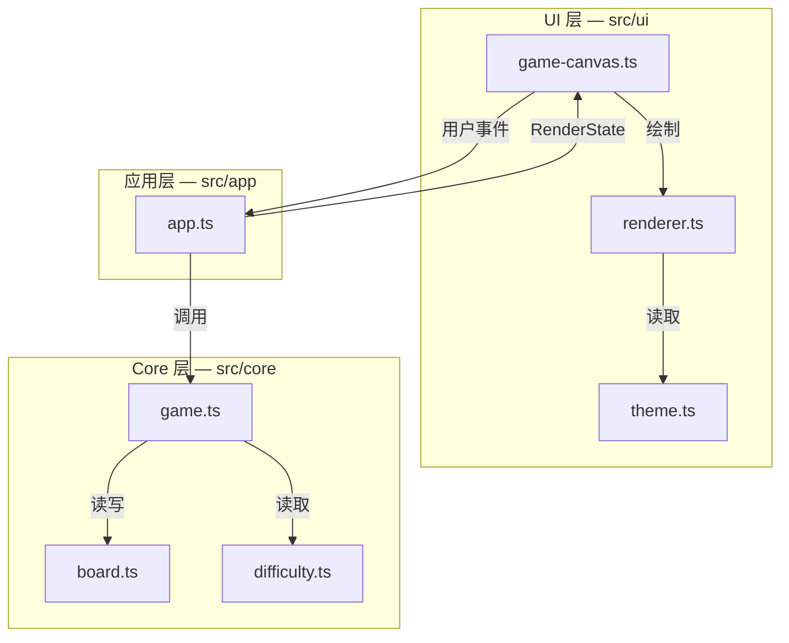

# 扫雷 Web 游戏 — 技术架构 v0.1

> 实现层面的单一参考。规则以 `docs/SPEC.md` 为准。

---

## 1. 技术选型

| 层 | 选型 | 理由 |
|----|------|------|
| 构建 | Vite 6 | 零配置、HMR 快、适合纯静态 SPA |
| 语言 | TypeScript 5 | 棋盘/状态类型安全，便于后续单测 |
| UI | **Canvas 2D** + 少量 DOM（标题） | 统一渲染面，便于扩展新玩法与特效；core 仍无 Canvas 依赖 |
| 测试 | Vitest（Phase 4+） | 与 Vite 同源；MVP 阶段 core 可后补 |

**刻意不引入：** React/Vue、状态管理库、CSS 框架。

---

## 2. 目录结构

```
chill/
├── docs/                    # 项目文档（SPEC、架构、Review）
├── .cursor/skills/minesweeper/
├── index.html
├── package.json
├── vite.config.ts
├── tsconfig.json
└── src/
    ├── main.ts              # 入口：挂载 app
    ├── styles/
    │   └── main.css         # 全局与棋盘样式
    ├── core/                # 纯逻辑，无 DOM 依赖
    │   ├── types.ts         # Cell、Board、GameStatus 等
    │   ├── difficulty.ts    # 难度预设
    │   ├── board.ts         # 布雷、邻雷数
    │   └── game.ts          # 状态机、开格/插旗、flood fill
    ├── ui/
    │   ├── theme.ts           # 尺寸、配色常量
    │   ├── renderer.ts        # 纯绘制 + hit-test（无事件）
    │   └── game-canvas.ts     # Canvas 元素、事件、计时、重绘调度
    └── app/
        └── app.ts           # 组装 core + ui，订阅状态变化
```

---

## 3. 分层职责



| 层 | 允许 | 禁止 |
|----|------|------|
| `core/` | 纯函数、类、数据结构 | `document`、`window`、DOM API |
| `ui/` | Canvas 绘制、hit-test、指针事件 | 布雷算法、胜负判定 |
| `app/` | 编排、事件路由、render 调度 | 复杂游戏规则（应委托 `game`） |

---

## 4. 核心数据模型

### 4.1 Cell（内部）

```typescript
interface Cell {
  isMine: boolean;
  adjacentMines: number; // 0–8，雷格恒为 0
  revealed: boolean;
  flagged: boolean;
}
```

### 4.2 Board

```typescript
interface Board {
  rows: number;
  cols: number;
  mineCount: number;
  cells: Cell[][];       // [row][col]
  minesPlaced: boolean;  // 首次点击前置 false
}
```

### 4.3 GameState

```typescript
type GameStatus = 'idle' | 'playing' | 'won' | 'lost';

interface GameState {
  status: GameStatus;
  board: Board;
  firstClickDone: boolean;
}
```

- `idle`：新局已创建，尚未布雷（等同 SPEC「等待首次点击」）
- `playing`：已布雷且未结束

### 4.4 对外 UI 快照（只读视图）

UI 不直接 mutate `Board`；`app` 从 `GameState` 投影：

```typescript
interface CellView {
  row: number;
  col: number;
  revealed: boolean;
  flagged: boolean;
  adjacentMines: number | null; // revealed 时可见，否则 null
  isMine: boolean | null;       // 仅 won/lost 时对 UI 暴露
}
```

---

## 5. 数据流

### 5.1 左键开格

```
Grid mousedown / contextmenu
  → hitTestCell / hitTestReset
  → app.onReveal / onToggleFlag / onReset
    → game.reveal(state, row, col)
      → [若 !minesPlaced] board.placeMines(safeZone)
      → board.reveal + floodFill
      → 更新 status (won/lost/playing)
    ← 新 GameState
  → app.render(state)
    → gameCanvas.render(views, status, flagCount)
    → renderer.renderFrame(ctx, layout, state)
```

### 5.2 右键插旗

```
Grid contextmenu / auxclick
  → app.onToggleFlag(row,col)
    → game.toggleFlag(state, row, col)  // playing 且 covered
  → app.render(state)
```

### 5.3 重开

```
HUD reset click
  → game.newGame(difficulty)
  → app.render(state); hud.resetTimer()
```

---

## 6. 状态变更策略

| 策略 | 说明 |
|------|------|
| Core 不可变倾向 | `reveal` / `toggleFlag` 返回**新** `GameState`（浅拷贝 board + 变更格），便于调试与单测 |
| UI 全量重绘 | 状态变化时 `renderFrame`；81 格 + HUD 开销极低，便于换肤/动画 |
| 计时器 | `game-canvas.ts` 内 `setInterval`，每秒触发 `paint()` |

---

## 7. 关键算法位置

| 算法 | 模块 | 函数（规划） |
|------|------|--------------|
| 随机布雷（排除安全区） | `board.ts` | `placeMines(board, exclude)` |
| 邻雷数 | `board.ts` | `computeAdjacentMines(board)` |
| Flood fill | `game.ts` | `revealCell` 内 BFS/DFS |
| 胜负判定 | `game.ts` | `checkWin(board)` |
| 首次点击安全 | `game.ts` | `reveal` 首击时传入 exclude 九宫格 |

---

## 8. 样式与渲染约定

- 主题常量：`src/ui/theme.ts`（`CELL_SIZE`、`THEME` 数字色）
- 绘制逻辑：`renderer.ts` 纯函数，**不绑定事件**，方便新玩法复用或替换
- Hit-test：`hitTestCell` / `hitTestReset` 与布局 metrics 解耦，扩展 HUD 控件时只改 layout
- HiDPI：`canvas.width = logical * devicePixelRatio`，`ctx.scale(dpr, dpr)`
- 页面标题仍用 DOM `#app` 内 `<h1>`，棋盘+HUD 全在单一 `<canvas>`

---

## 9. 构建与脚本

```json
{
  "scripts": {
    "dev": "vite",
    "build": "tsc && vite build",
    "preview": "vite preview"
  }
}
```

---

## 10. 版本

| 版本 | 日期 | 说明 |
|------|------|------|
| v0.1 | 2026-06-14 | MVP 架构：Vite + TS，core/ui/app 三层 |
| v0.2 | 2026-06-14 | UI 改为 Canvas 2D；renderer/theme 分层 |
