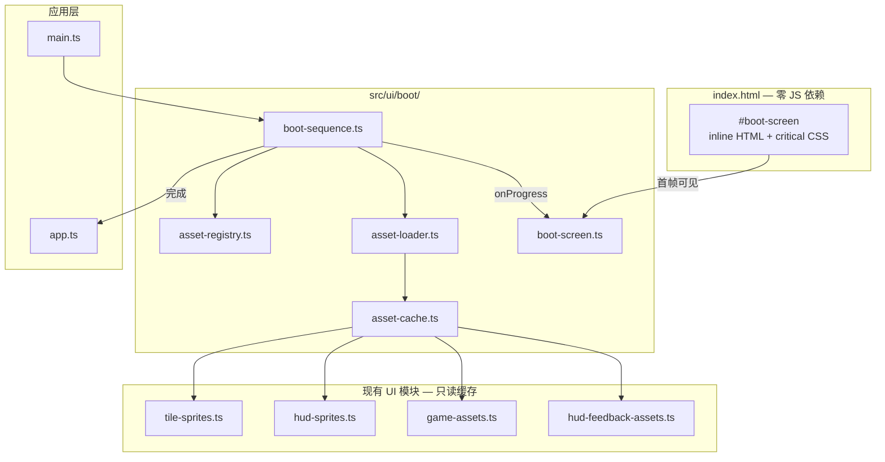
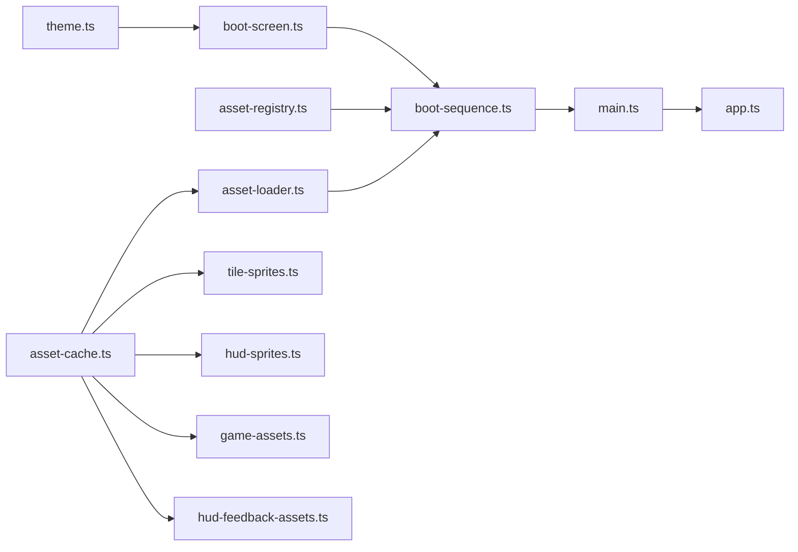

# 资源启动加载器技术方案

> 版本 v0.1 · 2026-06-28  
> 状态：**Phase A + B + C 已实现**  
> 实现后同步 `docs/MODULES.md` § `src/ui/boot/` 与 `docs/ARCHITECTURE.md` 启动流程小节。

---

## 1. 概述

### 1.1 目标

将当前分散在 `main.ts`、`tile-sprites.ts`、`hud-sprites.ts`、`game-assets.ts`、`hud-feedback-assets.ts` 中的**启动期资源加载**抽成独立模块 `src/ui/boot/`，并配套 **零游戏图片依赖** 的 DOM 加载页，使用户在弱网下也能**立刻**看到「正在加载」反馈。

| #   | 目标         | 说明                                                                   |
| --- | ------------ | ---------------------------------------------------------------------- |
| 1   | 模块独立     | 加载编排、进度计算、DOM 壳、资源缓存各自职责清晰                       |
| 2   | 首屏即时     | 加载 UI 由 `index.html` 内联 HTML/CSS 提供，不等待 JS bundle 或 PNG    |
| 3   | 风格一致     | 复用 `THEME` 色板：深空背景、indigo 能量条、HUD 玻璃面板、3×3 格子呼吸 |
| 4   | 真实进度     | 加权进度反映大 panel / FX 序列帧的实际下载量，非简单计数               |
| 5   | 兼容现有 API | `getTileSprites()`、`getGameCutout()` 等对外接口保持不变               |

### 1.2 设计结论（已定稿）

| 决策               | 结论                                                    |
| ------------------ | ------------------------------------------------------- |
| 加载页技术         | **DOM**（非 Canvas）；**零 `` / 零 manifest 资源** |
| 首屏来源           | **`index.html` 内联** Boot Shell + critical CSS         |
| 模块位置           | **`src/ui/boot/`**（UI 层，不进入 `core/`）             |
| 阻塞范围           | Tier 1 + Tier 2 完成后再 `mountApp()`                   |
| 音频               | Tier 3 后台预热，**不阻塞**进入游戏                     |
| Asset Gallery      | **不纳入**主 boot；路由进入时再加载                     |
| `loadRuntimeImage` | 逐步废弃 fire-and-forget 模式，改由 boot 统一预加载     |

### 1.3 非目标

- 不引入 Service Worker / Workbox（留 Phase C）
- 不在加载页使用 `start-panel.png`、logo 或任何游戏资产
- 不改 `src/core/` 规则与状态
- 不重构 Asset Gallery 的 lazy 预览逻辑
- 不在本阶段做 PNG → WebP 体积优化（与加载器正交）
- 不做 i18n 框架；文案先固定中文，预留 `label` 字段即可

---

## 2. 背景

### 2.1 现状

**启动链路**（`src/main.ts`）：

```
main.ts 执行
  → Promise.all([loadTileSprites, loadHudSprites, loadGameAssets])
  → mountApp(root)
```

等待期间 `#app` 为空，用户看到 `#09090b` 背景，无进度反馈。

**资源分散加载：**

| 模块                     | 方式                                             | 纳入 boot 等待  |
| ------------------------ | ------------------------------------------------ | --------------- |
| `tile-sprites.ts`        | 硬编码 ~15 张 PNG                                | ✅ 已在 main    |
| `hud-sprites.ts`         | 硬编码 ~13 张 PNG                                | ✅ 已在 main    |
| `game-assets.ts`         | `manifest.json` → cutouts / fx frames / uiPanels | ✅ 已在 main    |
| `hud-feedback-assets.ts` | `loadRuntimeImage()` 模块加载即发                | ❌ 未等待       |
| `game-audio.ts`          | `createGameAudio()` 时 `new Audio()`             | ❌ 首局可能延迟 |
| `primitives/assets.ts`   | `loadRuntimeImage()` 无 Promise                  | ❌ 无法计进度   |

**体量：** `public/assets` 约 35MB / 130+ 文件；大 panel（如 1536×1024）主导等待时间。

**视觉 token 来源：** `src/ui/theme.ts`（`#09090b`、`#6366f1`、`#27272a` 等）、`ambient-shell` 深空渐变、`main.css` indigo 能量条样式。

### 2.2 问题

1. **白屏 / 黑屏**：HTML 解析完到 `mountApp` 之间无 UI
2. **进度不可见**：`Promise.all` 只有 0% / 100%
3. **加载入口分裂**：部分资源在 boot 外静默加载，首帧可能缺图
4. **无法用游戏图做 loading**：会加剧「图片卡半天才出 loading 页」的问题

---

## 3. 模块架构

### 3.1 分层



### 3.2 职责边界

| 模块                | 职责                                            | 禁止                            |
| ------------------- | ----------------------------------------------- | ------------------------------- |
| `asset-registry.ts` | 声明启动期 URL 清单、tier、weight、group        | 发起网络请求                    |
| `asset-loader.ts`   | 并发加载、`Image`/`fetch`、失败重试、写入 cache | 操作 DOM                        |
| `asset-cache.ts`    | 全局 `Map<url, HTMLImageElement>` 与 typed 视图 | 业务绘制逻辑                    |
| `boot-sequence.ts`  | Tier 编排、进度聚合、完成/失败策略              | 直接改 `#boot-screen` innerHTML |
| `boot-screen.ts`    | 绑定/更新/淡出 DOM 壳；读 `THEME` 常量          | 加载资源                        |
| `index.html` inline | 静态壳 + critical CSS；JS 未到时即可见          | 引用任何 `/assets/` 路径        |

**约束：** `src/ui/boot/` 可依赖 `theme.ts`、`primitives` 数学工具；**不得**依赖 `game-canvas/`、`app/`。

---

## 4. 目录与文件

```
src/ui/boot/
├── index.ts                 # 对外唯一入口：runBootSequence, dismissBootScreen
├── types.ts                 # BootAsset, BootProgress, BootResult, BootTier
├── asset-registry.ts        # 静态清单 + manifest 展开
├── asset-loader.ts          # loadImageWithProgress, 并发池
├── asset-cache.ts           # getCachedImage, setCachedImage, typed getters
├── boot-sequence.ts         # runBootSequence(options)
├── boot-screen.ts           # bindBootScreen, updateBootProgress, dismissBootScreen
└── boot-screen.css          # 完整样式（维护用；index 内联 critical 子集）

index.html                   # 增加 #boot-screen + inline critical CSS
src/main.ts                  # runBootSequence → dismiss → mountApp
```

**样式双份策略：**

- `index.html`：内联 **critical** 子集（背景、panel、进度轨、shimmer、3×3 格子），保证首帧
- `boot-screen.css`：完整样式 + 媒体查询；由 `boot-screen.ts` 在 JS 就绪后 `import`（可选增强，非阻塞首屏）

---

## 5. 资源分级（Tier）

### 5.1 Tier 定义

| Tier  | 名称     | 内容                                                                 | 阻塞 mountApp |
| ----- | -------- | -------------------------------------------------------------------- | ------------- |
| **1** | 首帧棋盘 | tile sprites（hidden/revealed/hover/pressed/safe/num 1–8/mine/flag） | ✅            |
| **2** | 完整对局 | manifest cutouts、fx frames、uiPanels、hud-feedback-assets           | ✅            |
| **3** | 后台预热 | game audio clips + BGM                                               | ❌            |

### 5.2 Registry 条目结构

```typescript
interface BootAsset {
  id: string // 稳定 ID，如 "tile.cell-hidden"
  url: string // 绝对路径 "/assets/..."
  tier: 1 | 2 | 3
  group: BootAssetGroup
  weight: number // 进度权重，默认 1；大文件按 manifest 尺寸估算
  optional?: boolean // true → 失败不阻断 boot，记 warn
}

type BootAssetGroup = 'tiles' | 'hud-icons' | 'cutouts' | 'fx' | 'panels' | 'hud-feedback' | 'audio'
```

### 5.3 权重策略

避免「剩 1 张小图却显示 99%」：

| 来源                             | weight 计算                                        |
| -------------------------------- | -------------------------------------------------- |
| manifest `uiPanels.items.*`      | `width × height`（像素面积）                       |
| manifest `fx.effects.*.frames[]` | 单帧 `frameWidth × frameHeight`                    |
| 小 icon / tile                   | 固定 `4096`（64×64 等价）或 build 脚本写入真实字节 |
| audio                            | 不参与 blocking 进度；Tier 3 独立可选条            |

**Phase A：** 手写近似 weight（panel 用大常数，icon 用小常数）。  
**Phase B：** 构建脚本 `scripts/gen-boot-manifest.mjs` 扫描 `public/assets` 输出 `boot-manifest.json`。

### 5.4 Registry 来源

| group                       | 生成方式                                                                        |
| --------------------------- | ------------------------------------------------------------------------------- |
| `tiles`                     | 从 `tile-sprites.ts` 路径常量同步（单源：registry 导出常量，tile-sprites 引用） |
| `hud-icons`                 | 从 `HUD_ICON_NAMES` + heart 路径同步                                            |
| `cutouts` / `fx` / `panels` | 启动时 `fetch('/assets/game/manifest.json')` 展开                               |
| `hud-feedback`              | 从 `HUD_FEEDBACK_ASSETS` + `SCORE_DIGIT_ASSETS` URL 列表                        |
| `audio`                     | 从 `GAME_AUDIO_ASSETS` + `BGM_IDLE_SRC`                                         |

**原则：** URL 只在一处定义；现有模块改为「从 cache 读」，不再各自 `new Image()`。

---

## 6. 加载引擎（asset-loader）

### 6.1 并发与顺序

```
Tier 1 全部完成 → 开始 Tier 2（可与 Tier 1 尾部 overlap，但 progress 分阶段文案切换）
Tier 2 全部完成 → resolve boot → mountApp
Tier 3 fire-and-forget（不 await）
```

**并发上限：** `maxConcurrent = 8`（可配置）；同 tier 内 FIFO + 大 weight 优先（可选 Phase B）。

### 6.2 单资源加载

```typescript
function loadImageAsset(asset: BootAsset, cache: AssetCache, signal?: AbortSignal): Promise<BootAssetResult>
```

- 使用 `new Image()` + `onload` / `onerror`
- 成功：写入 `cache.set(url, img)`，返回 `{ id, ok: true, bytes?: number }`
- 失败：`optional` → warn + skip；否则 → 整次 boot 失败

**重试：** 非 optional 资源失败时最多重试 2 次，指数退避 300ms / 900ms。

### 6.3 与现有模块的衔接

Phase A 采用 **适配层**，不大改调用方签名：

```typescript
// tile-sprites.ts — 改后示意
export function loadTileSprites(): Promise<TileSprites | null> {
  const sprites = buildTileSpritesFromCache() // 从 asset-cache 组装
  return sprites ? Promise.resolve(sprites) : Promise.resolve(null)
}
```

`loadTileSprites` / `loadHudSprites` / `loadGameAssets` 保留导出，内部变为读 cache；**实际加载只发生一次**，由 `runBootSequence` 驱动。

`loadRuntimeImage(src)` 改为：

```typescript
export function loadRuntimeImage(src: string): HTMLImageElement {
  return getCachedImage(src) ?? createPlaceholderImage(src) // Phase A: 仍允许 lazy fallback + warn
}
```

Phase B：移除 placeholder，强制 boot 预加载所有 runtime 图。

---

## 7. 进度模型

### 7.1 计算公式

```
blockingProgress = Σ(completed.weight for tier in [1,2]) / Σ(all.weight for tier in [1,2])
```

Tier 3 不计入主进度条（避免等音频拖长条子）。

### 7.2 上报事件

```typescript
interface BootProgress {
  /** 0–1，blocking tiers */
  ratio: number
  /** 0–100，供 UI 显示，已 lerp 平滑 */
  displayPercent: number
  /** 当前阶段文案 */
  label: BootProgressLabel
  /** 可选：调试 */
  loaded: number
  total: number
  currentGroup?: BootAssetGroup
}

type BootProgressLabel =
  | 'starting' // JS 刚执行，registry 未就绪
  | 'tiles' // Tier 1
  | 'ui' // panels + hud
  | 'fx' // cutouts + fx frames + feedback
  | 'ready' // 即将 dismiss
```

### 7.3 UI 平滑

- **displayPercent**：`display += (target - display) * 0.15`（RAF 或每次 progress 事件）
- **进度条填充**：CSS `transform: scaleX(ratio)`，`transform-origin: left`
- **Indeterminate**：JS 未就绪或 `loaded === 0` 时，填充条 30% 宽 + `@keyframes boot-shimmer`
- **最短展示**：boot 完成后至少展示 **400ms** 再淡出，避免缓存命中时一闪而过

---

## 8. DOM 加载页（Boot Shell）

### 8.1 结构（index.html 内联）

```html
<div id="boot-screen" role="status" aria-live="polite" aria-busy="true">
  <div class="boot-screen__backdrop"></div>
  <div class="boot-screen__panel">
    <div class="boot-screen__grid" aria-hidden="true">
      <!-- 9 × .boot-screen__cell，其中 1 格 .boot-screen__cell--active -->
    </div>
    <h1 class="boot-screen__title">Minesweeper</h1>
    <p class="boot-screen__label" id="boot-label">正在启动…</p>
    <div class="boot-screen__track" role="progressbar" aria-valuemin="0" aria-valuemax="100" aria-valuenow="0">
      <div class="boot-screen__fill" id="boot-fill"></div>
    </div>
    <p class="boot-screen__percent" id="boot-percent" aria-hidden="true"></p>
  </div>
</div>
```

### 8.2 视觉规范（对齐 THEME）

| 元素     | 样式要点                                                                                                |
| -------- | ------------------------------------------------------------------------------------------------------- |
| 背景     | `linear-gradient(180deg, #06070d, #030408)` + 2 层 `radial-gradient` indigo 光斑（CSS animation drift） |
| Panel    | `background: rgba(24,24,27,0.82)`；`border: 1px solid rgba(255,255,255,0.08)`；`border-radius: 14px`    |
| 3×3 格子 | `background: #27272a`；active 格 `border-color: rgba(129,140,248,0.45)` + glow                          |
| 进度轨   | `height: 6px`；`background: rgba(255,255,255,0.08)`                                                     |
| 进度填充 | `linear-gradient(90deg, #6366f1, #818cf8)` + `box-shadow` glow                                          |
| 标题     | `DM Sans` / `system-ui`；`#fafafa`                                                                      |
| 百分比   | `IBM Plex Mono` / `monospace`；`#a5b4fc`；`font-variant-numeric: tabular-nums`                          |

**零图片、零外部 CSS 依赖**；Google Font 未加载时使用系统字体，不阻塞 shell。

### 8.3 boot-screen.ts API

```typescript
/** 绑定 index.html 已有节点；启动 displayPercent RAF 平滑 */
function bindBootScreen(): BootScreenController

interface BootScreenController {
  update(progress: BootProgress): void
  showError(message: string, onRetry: () => void): void
  dismiss(): Promise<void> // fade 280ms 后移除 #boot-screen
}
```

`runBootSequence` 接受 `screen?: BootScreenController`；测试时可注入 mock。

### 8.4 错误态

- Panel 内显示：`加载失败，请检查网络`
- 按钮：`重试` → 重新 `runBootSequence`
- 不自动 `mountApp`（Tier 1 失败无法可靠降级）

---

## 9. 启动序列（boot-sequence）

### 9.1 对外入口

```typescript
interface BootSequenceOptions {
  onProgress?: (progress: BootProgress) => void
  screen?: BootScreenController
  signal?: AbortSignal
}

interface BootResult {
  ok: boolean
  loaded: number
  failed: BootAsset[]
  durationMs: number
}

function runBootSequence(options?: BootSequenceOptions): Promise<BootResult>
```

### 9.2 main.ts 改后流程

```
1. bindBootScreen()                    // 接管已有 #boot-screen
2. await runBootSequence({ onProgress: screen.update })
3. if (!result.ok) → showError + retry loop
4. await screen.dismiss()
5. mountApp(root)
6. window.addEventListener('popstate', …)
7. void preloadTier3Audio()            // 不 await
```

### 9.3 Asset Gallery 路由

`/assets`、`/lab` 仍走 `app.ts` 路由；**不调用** `runBootSequence` 第二次（cache 命中即同步返回）。

若未来 gallery 需额外资源：新增 `loadGalleryAssets()`，独立 progress UI 或 silent load。

---

## 10. 音频（Tier 3）

```typescript
function preloadGameAudio(): Promise<void>
```

- 创建 `Audio` 元素，`preload = 'auto'`
- 不阻塞 `mountApp`
- `createGameAudio()` 复用已缓冲 clip（Phase B）；Phase A 可仍 lazy create，仅提前 fetch

可选：加载页底部小字 `音频资源后台加载中…`（不计入主进度）。

---

## 11. 分阶段实现

### Phase A — 最小可用（推荐先做）

- [x] `index.html` Boot Shell + critical CSS
- [x] `src/ui/boot/` 全套模块（registry / loader / cache / sequence / screen）
- [x] 手写 registry：tiles + hud + manifest 展开 + hud-feedback URLs
- [x] `main.ts` 接入；现有三个 loader 改读 cache
- [x] 加权进度（0→100% 确定性进度条 + 光效）+ 400ms 最短展示
- [x] Tier 1 失败 → 错误重试 UI

**验收：** 弱网节流下，HTML 解析后 **<100ms** 可见加载页；进度条随下载推进；完成后正常进局无缺图。

### Phase B — 体验与维护

- [x] `scripts/gen-boot-manifest.ts` 生成 weight → `public/assets/boot-weights.json`
- [x] 大文件优先队列（tier 内按 weight 降序 + Tier 1 先于 Tier 2）
- [x] `loadRuntimeImage` 严格 cache-only（boot 完成后 placeholder + warn）
- [x] `preloadGameAudio` + `createGameAudio` 复用 `audio-cache` 预热
- [x] 单元测试：`computeBootProgress`、`dedupeBootAssets`、load priority、registry

### Phase C — 长期（可选）

- [x] Service Worker 静态缓存（`scripts/gen-service-worker.ts` → `public/sw.js`，`/assets/*` cache-first）
- [x] 路由级 gallery 分包（`app.ts` 动态 `import()` Asset Lab / UI Lab / Responsive）
- [x] 图片格式优化（`scripts/optimize-boot-webp.ts` + `boot-webp-map.json` + runtime resolve）

---

## 12. 测试与验收

### 12.1 手动测试

| #   | 场景                         | 预期                                           |
| --- | ---------------------------- | ---------------------------------------------- |
| 1   | 正常网络首次访问             | 立刻见 Boot Shell → 进度增长 → 淡出 → 游戏可玩 |
| 2   | DevTools Slow 3G             | 长时间加载仍有 shimmer/数字更新，无白屏        |
| 3   | 阻断某 Tier 1 PNG            | 错误 UI + 重试可用                             |
| 4   | 二次刷新（缓存）             | 进度条仍可见 ≥400ms，然后快速进入              |
| 5   | 进局后 HUD / FX / Start 面板 | 无闪烁、无 placeholder                         |
| 6   | `/assets` 路由               | 不重复全量 boot；页面正常                      |

### 12.2 自动化（Phase B）

- Vitest：`computeBootProgress(loaded, total)` 边界
- Vitest：registry 展开 manifest 后 URL 无重复
- 可选：Playwright `networkidle` 截图对比 boot shell

### 12.3 性能指标

| 指标                   | 目标                               |
| ---------------------- | ---------------------------------- |
| Boot Shell 首次绘制    | HTML 解析后即刻（不依赖 JS）       |
| `runBootSequence` 启动 | <16ms（registry 展开）             |
| dismiss 动画           | 280ms opacity                      |
| 主线程 long task       | 加载循环不阻塞 >50ms（分批 await） |

---

## 13. 文档与迭代同步

实现完成后更新：

| 文档                   | 变更                                         |
| ---------------------- | -------------------------------------------- |
| `docs/MODULES.md`      | 新增 `src/ui/boot/` 节                       |
| `docs/ARCHITECTURE.md` | § 启动流程：`index.html` → boot → `mountApp` |
| `docs/PROJECT.md`      | Current Task 或 TODO 勾选                    |
| `docs/REVIEW-LOG.md`   | Review 结论                                  |

---

## 14. 风险与对策

| 风险                                 | 对策                                                |
| ------------------------------------ | --------------------------------------------------- |
| inline CSS 与 `boot-screen.css` 漂移 | Phase B 构建时从单源生成 critical                   |
| manifest 与 registry 不同步          | registry 唯一展开 manifest；单测校验 URL 存在       |
| 双份 load（boot + 旧 loader）        | boot 完成后 cache 命中；旧 loader 仅组装 typed 对象 |
| Google Font 慢                       | shell 用 system-ui fallback                         |
| 进度条长时间 99%                     | 按 weight 计 progress；大 panel 单独占权重          |

---

## 15. 附录：模块依赖图



---

## 版本

| 版本 | 日期       | 说明                                         |
| ---- | ---------- | -------------------------------------------- |
| v0.1 | 2026-06-28 | 初稿：独立 boot 模块 + DOM shell + tier 分级 |
