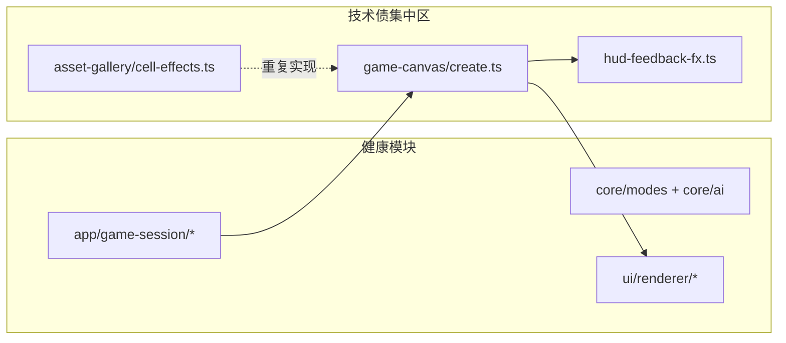
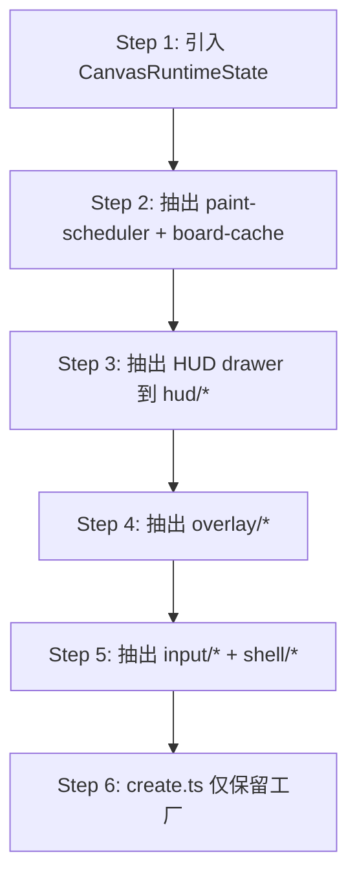

# 代码优化技术方案 v0.1

> Canvas 运行时与资产 Lab 的模块化重构方案。  
> 规则与玩法仍以 `docs/SPEC.md`、`docs/MODES.md` 为准；分层约束以 `docs/ARCHITECTURE.md` 为准。  
> 本文档描述**如何拆、如何复用**，不改变现有游戏规则与 UX 行为。

---

## 1. 背景与动机

### 1.1 现状

项目已从 MVP（9×9 经典扫雷）演进至 **Endless 无尽模式**：fullscreen Canvas、HUD v3 反馈、AI 自动步进、ambient 背景等。Core / Renderer / App 编排层已模块化，但 **Canvas 运行时与资产预览 Lab 仍高度耦合**，表现为：

| 指标 | 数值 |
|------|------|
| `src/` TypeScript 文件 | ~80 |
| 总代码行数 | ~21,000 |
| 单文件 >800 行 | **5 个** |
| 最大单文件 | `game-canvas/create.ts` **3,402 行** |

### 1.2 优化目标

| 目标 | 说明 |
|------|------|
| **单文件 ≤800 行** | 硬性约束；拆分后无例外 |
| **能拆则拆** | 按职责边界拆模块，禁止「上帝闭包」 |
| **能复则复** | Runtime 与 Asset Gallery 共用同一套 drawer |
| **零行为变更** | 重构阶段不改变 SPEC / 可见 UX / 性能特征 |
| **可测性** | Core 与纯绘制函数可单测；Canvas 集成可视觉回归 |

### 1.3 非目标

- 不引入 React/Vue、状态管理库、CSS 框架
- 不在本方案内改 HUD 视觉设计（见 `docs/ENDLESS-HUD-FEEDBACK-UX-PLAN.md`）
- 不一次性重写 Endless 规则或 AI 策略

---

## 2. 现状诊断

### 2.1 超标文件清单

| 文件 | 行数 | 根因 |
|------|------|------|
| `src/ui/game-canvas/create.ts` | 3,402 | 布局、绘制、动画、HUD、Overlay、输入、状态机全在一个闭包 |
| `src/app/asset-gallery/cell-effects.ts` | 3,274 | 预览 Lab 重实现运行时 HUD / 格子特效 |
| `src/ui/hud-feedback-fx.ts` | 1,103 | ScorePop / ComboBurst / 电流特效 / Preview 混装 |
| `src/ui/cell-fx.ts` | 844 | 呼吸、揭示、烟雾、旗标、面板扫描 |
| `src/ui/ambient-backdrop/glyphs.ts` | 827 | 字形数据与绘制逻辑耦合 |

接近上限（Phase 2 后关注）：`core/ai/moves.ts`（594）、`app/asset-gallery.ts`（595）、`app/ui-lab.ts`（530）。

### 2.2 架构健康度



**保留不变：**

- `core/`：无 DOM；规则在 `modes/endless/` + `ai/`
- `ui/renderer/`：纯绘制 + hit-test，无事件
- `app/game-session/`：`mount` / `scroll` / `ai-loop` / `logging` 职责清晰

**主要债务：**

- `createGameCanvas()` 内含 ~80 个嵌套函数、40+ 闭包状态变量
- 工具函数（`clamp01`、`easeOutCubic`、`roundedRectPath`）在 5+ 文件重复
- Asset Gallery 与 Runtime 各有一套 HUD Scene 绘制（如 `drawScoreHud` vs `drawScoreHudV3Scene`）

### 2.3 重复代码矩阵

| 符号 / 逻辑 | 重复位置 |
|-------------|----------|
| `clamp01` | `create.ts`, `hud-feedback-fx.ts`, `cell-fx.ts`, `cell-effects.ts`, `ambient-backdrop/math.ts` |
| `easeOutCubic` / `easeOutBack` | `create.ts`, `hud-feedback-fx.ts`, `cell-effects.ts` |
| `roundedPath` / `roundedRectPath` | `create.ts`, `cell-fx.ts`, `ui-lab.ts`, `cell-effects.ts` |
| `loadRuntimeImage` | `create.ts`, `cell-effects.ts` |
| Score / Combo / LifeLoss HUD | `create.ts` ↔ `cell-effects.ts` |
| `drawFeedbackAsset` / `drawSheetFrameContained` | `create.ts` ↔ `cell-effects.ts` |

---

## 3. 目标架构

### 3.1 分层原则（延续 ARCHITECTURE）

| 层 | 允许 | 禁止 |
|----|------|------|
| `core/` | 纯函数、数据结构 | `document` / `window` |
| `ui/primitives/` | 数学、路径、资源加载 | 游戏状态、业务逻辑 |
| `ui/renderer/` | 棋盘格绘制、hit-test | 事件监听、计时器 |
| `ui/game-canvas/` | Canvas 生命周期、RAF、输入、HUD 编排 | 布雷、flood fill、胜负 |
| `ui/hud-feedback/`、`ui/cell-fx/` | 纯 Canvas 绘制函数 | 闭包可变状态 |
| `app/` | 编排、路由 | 复杂绘制 |

### 3.2 目标目录树

```
src/
├── core/                          # 保持；ai/moves 可选再拆
│   └── ai/
│       └── moves/                 # NEW（Phase 5，可选）
├── ui/
│   ├── primitives/                # NEW — Phase 0
│   │   ├── math.ts
│   │   ├── path.ts
│   │   ├── assets.ts
│   │   └── index.ts
│   ├── game-canvas/               # Phase 1 重构
│   │   ├── index.ts
│   │   ├── types.ts
│   │   ├── create.ts              # ≤200 行：工厂 + Controller
│   │   ├── assets/
│   │   ├── layout/
│   │   ├── runtime/
│   │   ├── hud/
│   │   ├── overlay/
│   │   ├── shell/
│   │   └── input/
│   ├── hud-feedback/              # Phase 2（自 hud-feedback-fx.ts 演进）
│   ├── cell-fx/                   # Phase 3（自 cell-fx.ts 演进）
│   ├── renderer/                  # 保持
│   └── ambient-backdrop/
│       └── glyphs/                # Phase 6：data.ts + draw.ts
└── app/
    ├── game-session/              # 保持
    └── asset-gallery/             # Phase 4：cell-effects 瘦化
        ├── cell-effects.ts
        ├── cell-effect-scenes.ts
        └── cell-effect-panels.ts
```

### 3.3 状态管理约定

将 `create.ts` 内散落的 `let` 收敛为显式状态对象，各子模块以 `(ctx, state, now)` 纯函数签名读写：

```typescript
/** game-canvas/runtime/state.ts */
export interface CanvasRuntimeState {
  views: CellView[];
  status: GameStatus;
  flagCount: number;
  layout: LayoutState;      // squareLayout, offsets, hit rects
  fx: FxState;              // combo / score / lifeLoss / difficulty events
  animation: AnimationState; // RAF, board cache, cell effects queue
  hud: HudDisplayState;     // score count-up, lastCombo, etc.
}
```

**规则：**

- 子模块**不**持有模块级可变状态（除 assets 预加载 Image）
- `create.ts` 持有唯一 `state` 实例，传给各 `paint*` / `draw*` / `handle*`
- 便于 Asset Gallery 直接调用同一 `drawScoreHud(ctx, …)` 而无需实例化 Canvas

---

## 4. 分阶段实施计划

### Phase 0 — 公共 Primitives（P0，1–2 天）

**产出：**

```
src/ui/primitives/
├── math.ts      # clamp01, lerp, easeOutCubic, easeOutBack, hash01
├── path.ts      # roundedRectPath, fillRounded, strokeRounded
├── assets.ts    # loadRuntimeImage(src): HTMLImageElement
└── index.ts
```

**迁移顺序：**

1. 新建 primitives，从 `ambient-backdrop/math.ts` 复用已有 `clamp01` / `lerp` / `hash01`
2. 替换 `hud-feedback-fx.ts`、`cell-fx.ts` 中的本地实现
3. 替换 `create.ts`、`cell-effects.ts`、`ui-lab.ts`

**验收：**

- [ ] `rg "function clamp01" src/` 仅命中 `primitives/math.ts`
- [ ] `npm run build` 通过
- [ ] 无视觉差异（Asset Gallery 抽帧对比）

---

### Phase 1 — 拆分 `game-canvas/create.ts`（P0，3–5 天）

**目标：** `create.ts` ≤200 行；最大子模块 ≤400 行。

#### 1.1 模块划分

| 模块 | 文件 | 职责 | 预估行数 |
|------|------|------|----------|
| 工厂入口 | `create.ts` | 组装 state、绑定事件、返回 Controller | ~150 |
| 资源 | `assets/hud-feedback-assets.ts` | `hudFeedbackAssets`、`scoreDigitAssets` | ~30 |
| 布局 | `layout/viewport-fit.ts` | `fitCellSizeForViewport`、`syncViewportFitLayout` | ~80 |
| 布局 | `layout/board-layout.ts` | `boardBaseLayout`、`applySquareLayout`、`syncPreviewLayout` | ~100 |
| 运行时 | `runtime/paint-scheduler.ts` | RAF、`needsContinuousRepaint`、`scheduleContinuousRepaint` | ~120 |
| 运行时 | `runtime/board-layer-cache.ts` | cache key、离屏 static 层 | ~100 |
| 运行时 | `runtime/cell-effects-runtime.ts` | `collectCellEffects`、`drawCellEffects` | ~200 |
| 运行时 | `runtime/scroll-ghost-fx.ts` | scroll mine ghost 队列与绘制 | ~120 |
| 运行时 | `runtime/particle-system.ts` | combo/score 粒子 | ~100 |
| 运行时 | `runtime/paint.ts` | `paint()` 主循环编排 | ~150 |
| HUD | `hud/canvas-primitives.ts` | `drawArcadePanel`、`drawUiPanelImage` | ~150 |
| HUD | `hud/score-hud.ts` | `drawScoreHud`、score count-up | ~250 |
| HUD | `hud/combo-hud.ts` | `drawComboHud`、`drawComboRailGlow` | ~200 |
| HUD | `hud/lives-hud.ts` | `drawLivesHud`、heart metrics | ~120 |
| HUD | `hud/bgm-mute-hud.ts` | BGM 静音按钮 | ~80 |
| HUD | `hud/dev-controls.ts` | Dev Auto / Speed Up | ~100 |
| HUD | `hud/fullscreen-hud.ts` | 顶栏编排 | ~150 |
| Overlay | `overlay/panel-transition.ts` | Start/Retry 面板过渡 | ~150 |
| Overlay | `overlay/event-overlay.ts` | score/break/lifeLoss 事件状态机 | ~200 |
| Overlay | `overlay/life-loss-event.ts` | `drawLifeLossEvent` | ~150 |
| Overlay | `overlay/difficulty-alert.ts` | speed-up / danger-rise | ~180 |
| Overlay | `overlay/heart-refill-fx.ts` | 回血特效 | ~100 |
| Overlay | `overlay/level-up-fx.ts` | Combo tier 升级 | ~80 |
| Shell | `shell/background.ts` | `drawShellBackground` | ~60 |
| Shell | `shell/ambient-shell.ts` | backdrop mood、ambient 层 | ~120 |
| 输入 | `input/pointer-handlers.ts` | mousedown / contextmenu / dblclick | ~150 |
| 输入 | `input/ui-hit-test.ts` | `hitInteractiveUi`、`insideRect` | ~80 |
| 状态 | `runtime/state.ts` | `CanvasRuntimeState` 类型定义 | ~80 |

#### 1.2 迁移策略（降低风险）



每步完成后：

1. `npm run build`
2. 手动跑 Endless 一局：开格、插旗、Chord、卷轴、踩雷、胜/负
3. Asset Gallery 相关 panel 视觉抽检

#### 1.3 对外 API 不变

`src/ui/game-canvas/index.ts` 继续导出：

- `createGameCanvas`
- `GameCanvasController` / `GameCanvasCallbacks` / `GameCanvasOptions` 等类型

`app/game-session/mount.ts` **不应**因 import 路径变化而大幅修改。

**验收：**

- [ ] `create.ts` ≤200 行
- [ ] `game-canvas/` 下所有文件 ≤800 行
- [ ] 闭包内无新增 `function clamp01` 等重复工具
- [ ] Endless 全流程行为与 Phase 1 前一致

---

### Phase 2 — 拆分 `hud-feedback-fx.ts`（P1，1–2 天）

**目标：** 1,103 行 → 6–8 个文件，各 ≤250 行。

```
src/ui/hud-feedback/
├── index.ts              # re-export，保持旧 import 路径兼容（可选 barrel 重定向）
├── types.ts
├── combo-palette.ts      # tier、palette、glow、filter
├── progress.ts           # scorePop/comboBurst runtime & preview progress
├── score-pop.ts          # drawScorePopV3、layout resolve
├── combo-burst.ts        # drawComboBurstV3、layout resolve
├── electric-field.ts     # 电流、lightning、combo rail arcs
├── asset-draw.ts         # measureContainedAsset、drawContainedFeedbackAsset
└── preview.ts            # *PreviewDecorations（供 Lab 使用）
```

**兼容策略：**

- 保留 `src/ui/hud-feedback-fx.ts` 为薄 re-export（deprecated 注释），避免一次性改全库 import
- 新代码只 import `ui/hud-feedback/`

**验收：**

- [ ] 各子文件 ≤800 行（预期 ≤250）
- [ ] Combo burst / Score pop 动画时序不变
- [ ] `isScorePopFxVisible` / `isComboBurstFxVisible` 行为不变

---

### Phase 3 — 拆分 `cell-fx.ts`（P2，1 天）

```
src/ui/cell-fx/
├── index.ts
├── breath-hover.ts
├── reveal-transition.ts
├── mine-smoke.ts
├── flag-mark.ts
├── panel-scan.ts
├── particles.ts
└── board-overlays.ts
```

同样保留 `cell-fx.ts` 薄 re-export 过渡。

**验收：**

- [ ] 格子呼吸、悬停、揭示过渡、踩雷烟雾与现版一致
- [ ] `drawBoardCellOverlays` 签名不变

---

### Phase 4 — 瘦化 Asset Gallery（P1，2–3 天）

**原则：** Lab **只编排预览**，不重写 Runtime drawer。

#### 4.1 目标结构

```
src/app/asset-gallery/
├── cell-effects.ts         # ~400 行：面板注册、预览循环、缩略图导出
├── cell-effect-scenes.ts   # ~300 行：组合 runtime drawer 的 Scene 适配器
└── cell-effect-panels.ts   # ~200 行：EffectPanelId 元数据
```

#### 4.2 删除 / 替换清单

| 本地实现（删除或改为薄包装） | 改为调用 |
|------------------------------|----------|
| `drawScoreHudV3Scene` | `hud/score-hud.ts` → `drawScoreHud` |
| `drawComboHudV3Scene` | `hud/combo-hud.ts` → `drawComboHud` |
| `drawLifeLossSlash` | `overlay/life-loss-event.ts` 导出 |
| `drawFeedbackAsset` / `drawFilteredFeedbackAsset` | `hud-feedback/asset-draw.ts` |
| `clamp01` / `easeOutCubic` 等 | `ui/primitives/` |

#### 4.3 Scene 适配器模式

```typescript
// cell-effect-scenes.ts
export function renderScoreHudPreview(
  ctx: CanvasRenderingContext2D,
  w: number,
  h: number,
  tMs: number,
  score = 39160,
): void {
  paintStageBg(ctx, w, h);
  const scale = w / 390;
  drawScoreHud(ctx, w * 0.28, h * 0.12, score, scale, tMs);
}
```

**验收：**

- [ ] `cell-effects.ts` + 拆分文件合计 ≤900 行，单文件 ≤400
- [ ] Asset Gallery 所有 Effect Panel 与重构前截图 diff 可接受
- [ ] 无「Lab 独有」的 HUD 绘制逻辑（除背景 / 布局适配）

---

### Phase 5 — Core AI `moves` 拆分（P2，可选，1 天）

当前 `core/ai/moves.ts`（594 行）可拆为：

```
src/core/ai/moves/
├── index.ts           # export solveBoard, pickTacticalMove
├── bottom-row.ts      # bottomRowUnresolved, rowScore
├── deterministic.ts   # 确定性 deduce 动作
├── guess.ts           # CSP 猜测
└── tactical.ts        # pickTacticalMove
```

另：`engine.ts` 中 `applyAiMove` 的 contradicted flag 逻辑 → `core/ai/executor.ts`（~60 行）。

**验收：**

- [ ] `solveBoard` 对外签名不变
- [ ] 现有 AI 模拟脚本输出一致（`scripts/simulate-*.ts`）

---

### Phase 6 — Ambient Glyphs 数据分离（P3，0.5 天）

```
src/ui/ambient-backdrop/glyphs/
├── data.ts    # 路径 / 坐标纯数据
└── draw.ts    # 绘制函数，import data
```

**验收：**

- [ ] `glyphs/data.ts` 无 Canvas 依赖
- [ ] 背景动画视觉无差异

---

### Phase 7 — 文档与测试同步（P3，持续）

| 文档 | 更新内容 |
|------|----------|
| `docs/ARCHITECTURE.md` | 目录树、Endless fullscreen 数据流 |
| `docs/MODULES.md` | `game-canvas/`、`hud-feedback/`、`primitives/` 导出表 |
| `docs/PROJECT.md` | 增加 Refactor Phase 勾选；Current Task 可并列 |
| `docs/REVIEW-LOG.md` | 每 Phase 完成后记录 Review |

**测试：**

- [ ] `core/modes/endless/` 关键路径 Vitest（reveal、scroll、边界）
- [ ] `core/ai/deduction.ts` / `moves/` 单测
- [ ] 可选：Asset Gallery 静态帧 snapshot（后续 Phase 4+）

---

## 5. 实施优先级总览

| 优先级 | Phase | 预估工时 | 风险 | 收益 |
|--------|-------|----------|------|------|
| **P0** | 0 — Primitives | 1–2 天 | 低 | 立即去重，后续拆分基础 |
| **P0** | 1 — `create.ts` | 3–5 天 | 中 | 最大可维护性提升 |
| **P1** | 4 — Asset Gallery | 2–3 天 | 中 | 消除 ~2000 行重复 |
| **P1** | 2 — `hud-feedback` | 1–2 天 | 低 | 合规 + 清晰边界 |
| **P2** | 3 — `cell-fx` | 1 天 | 低 | 合规 |
| **P2** | 5 — Core moves | 1 天 | 低 | AI 可测 |
| **P3** | 6 — Glyphs | 0.5 天 | 低 | 数据/绘制分离 |
| **P3** | 7 — 文档/测试 | 持续 | 无 | 长期维护 |

**建议迭代顺序：** 0 → 1（分 6 步）→ 2 → 4 → 3 → 5 → 6 → 7

Phase 1 与 Phase 2 可部分并行（HUD drawer 抽出后，Phase 2 直接搬文件）。

---

## 6. 风险与缓解

| 风险 | 影响 | 缓解措施 |
|------|------|----------|
| 闭包状态遗漏迁移 | 运行时 bug、FX 不触发 | 先引入 `CanvasRuntimeState`；每步全流程手测 |
| 重复 repaint / 性能回退 | FPS 下降 | `paint-scheduler` 保持单点 RAF；不分散 `scheduleAnimationFrame` |
| import 路径震荡 | 大量 PR conflict | 旧路径 thin re-export + deprecated 注释 |
| Lab 与 Runtime 视觉漂移 | 资产验收失败 | Phase 4 以 Gallery panel 为回归基准 |
| 范围蔓延 | 工期失控 | 严格「零行为变更」；UX 改动走独立文档 |

---

## 7. 验收标准（全局 Done Definition）

重构 Phase 0–7 全部完成后：

- [x] **行数：** `src/**/*.ts` 无文件 >800 行（最大 `cell-effects.ts` 777 行，2026-06-28）
- [x] **重复：** `clamp01` / `easeOutCubic` / `roundedRectPath` 统一在 `ui/primitives/`
- [x] **复用：** Asset Gallery HUD Scene 调用 runtime drawer；cell/board 预览在 `ui/cell-fx/gallery/`
- [x] **分层：** `core/` 无 DOM；`renderer/` 无事件；规则不在 `ui/` 修改
- [x] **构建：** `npm run build` 零错误
- [x] **行为：** 零行为变更重构；Endless 全流程待手测回归
- [x] **文档：** `ARCHITECTURE.md` / `MODULES.md` 已同步（v0.2）

---

## 8. 附录

### 8.1 相关文档

| 文档 | 关系 |
|------|------|
| `docs/ARCHITECTURE.md` | 分层约束；Phase 7 同步更新 |
| `docs/MODULES.md` | 模块接口；Phase 7 同步更新 |
| `docs/ENDLESS-HUD-FEEDBACK-UX-PLAN.md` | UX 变更独立于此 refactor |
| `docs/REVIEW-LOG.md` | 每 Phase Review 记录 |

### 8.2 命名约定

- **Drawer：** 纯 `(ctx, …) => void` 绘制函数，无闭包状态
- **Runtime：** 含 RAF、队列、cache 的有状态模块，状态集中在 `CanvasRuntimeState`
- **Scene：** Lab 用 `(ctx, w, h, tMs, …) => void` 适配器，内部调用 Drawer
- **re-export 过渡文件：** 保留 1 个迭代周期，注释 `@deprecated import from 'ui/hud-feedback'`

### 8.3 版本记录

| 版本 | 日期 | 说明 |
|------|------|------|
| v0.1 | 2026-06-28 | 初稿：现状诊断、7 Phase 方案、验收标准 |
| v0.2 | 2026-06-28 | Phase 0–7 实施完成；`create.ts` 3402→190 行；全库单文件 ≤800 行 |
