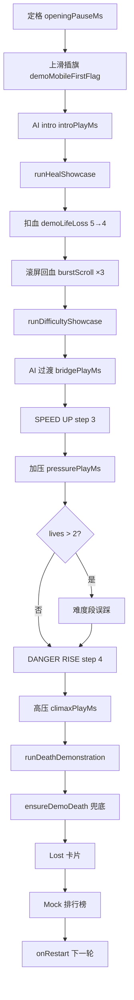

# Landing Attract DEMO 规范

> **Canonical spec.** 实现必须与本文件一致。  
> 代码入口：`game-client/app/landing-preview/demo-script.ts` → `runTimeline()`  
> 挂载层：`game-client/app/landing-preview/mount.ts`  
> 固定 seed：`DEMO_SCRIPT_SEED = 0xdeadc0de`

---

## 0. 核心原则

1. **单局 session、单条时间线** — 一轮循环内只用同一个 `ModeSession`，从头到尾不重开、不 soft reset、**无 A/B 段**。
2. **顺序不可打乱** — 必须是：开场 → 游玩 → 受伤/回血 → 难度上升 → 死亡 → Game Over → 排行榜 → 重开。
3. **不改游戏机制** — 所有状态变化走 core 引擎（`revealAt` / `toggleMarkAt` / `performScrollTick`），禁止作弊式 patch。
4. **改代码先改文档** — 调整顺序、时长、段内行为时，先更新本文档再改 `demo-script.ts`。

---

## 1. 硬性要求

| #   | 要求         | 验收标准                                                                               |
| --- | ------------ | -------------------------------------------------------------------------------------- |
| R1  | 不改游戏机制 | 无强制 `lives`、无拔旗踩雷、无 `minesDefused` 清零、无批量去掉底部雷旗                 |
| R2  | 模拟真实游玩 | 死亡段：`demoEndgamePressure` 每轮先安全开格再误踩 1 雷；禁止连续只点雷                |
| R3  | 回血演示     | intro 后展示一次扣血 + `burstScrollAfterDamage`（底部 4 旗 + 滚屏 ×3）， lives 回升    |
| R4  | 难度演示     | 同局内依次展示 `SPEED UP`（step 3）与 `DANGER RISE ×3`（step 4），HUD 出现对应 alert   |
| R5  | 死亡在最后   | `runHealShowcase` → `runDifficultyShowcase` 全部完成后，才调用 `runDeathDemonstration` |
| R6  | 难度段可扣血 | `lives > 2` 时在 SPEED UP 加压段后脚本误踩一次（`runDifficultyShowcase` 内）           |
| R7  | 结尾卡片     | 死亡后：`lost` 相位 → `leaderboard` 相位 → `onRestart()`                               |

---

## 2. 流程总览（唯一正确顺序）



### 2.1 与代码函数映射

| 步骤  | 文档阶段     | 代码函数 / 调用                                                                                 |
| ----- | ------------ | ----------------------------------------------------------------------------------------------- |
| 1–3   | 开场 + intro | `runTimeline` 内：`waitMs` → `demoMobileFirstFlag` → `startScrollAndAi` → `waitMs(introPlayMs)` |
| 4–5   | 受伤 + 回血  | `runHealShowcase()`                                                                             |
| 6–9   | 难度上升     | `runDifficultyShowcase()`                                                                       |
| 10    | 死亡演示     | `runDeathDemonstration()`                                                                       |
| 11    | 兜底死亡     | `ensureDemoDeath()`                                                                             |
| 12–13 | 结尾         | `setPhase('lost')` → `setPhase('leaderboard')` → `callbacks.onRestart()`                        |

**`runTimeline()` 内调用顺序（不可变更）：**

```text
syncDifficultyStep(DEMO_START_STEP)
→ openingPause → demoMobileFirstFlag → introPlay
→ runHealShowcase
→ runDifficultyShowcase
→ runDeathDemonstration
→ ensureDemoDeath
→ lost → leaderboard → onRestart
```

---

## 3. 阶段细则

### 3.1 开局棋盘（`createScriptedOpeningSession`）

- 固定 seed 开局，`endlessBeginRun`
- **下半屏**安全格全部翻开，**上半屏**保持覆盖
- 初始 HUD：score 1420、scrollRowCount 9、minesDefused 1、defuseCombo 2、lives 5
- 难度起点：`DEMO_START_STEP = 2`（Tier-2，×2 行离开）

### 3.2 阶段 A — 开场 + AI intro

| 动作     | 常量              | 值     | 说明                                       |
| -------- | ----------------- | ------ | ------------------------------------------ |
| 定格     | `openingPauseMs`  | 1000ms | 展示半盘局面                               |
| 上滑插旗 | `firstFlagHoldMs` | 480ms  | `demoMobileFirstFlag`，每轮 **仅一次**     |
| AI 游玩  | `introPlayMs`     | 4500ms | `startScrollAndAi`，自然 reveal/flag/chord |

### 3.3 阶段 B — 受伤 + 回血（`runHealShowcase`）

**前置：** `stopScrollAndAi`

| 动作       | 常量                                    | 值                       |
| ---------- | --------------------------------------- | ------------------------ |
| 脚本踩雷   | `lifeLossHesitationMs`                  | 600–950ms 犹豫           | hint `guess`，5→4                 |
| 扣血后停顿 | `afterLifeLossMs`                       | 1200ms                   | 播 lifeLoss + break FX            |
| 回血准备   | —                                       | `prepareHealScrollBoard` | 底行插旗 4 雷 + 翻开底区安全格    |
| 滚屏回血   | `burstScrollCount` × `burstScrollGapMs` | 3 × 420ms                | `performScrollTick`，真实银行回血 |
| 回血后停顿 | `afterBurstScrollMs`                    | 1200ms                   | 播 heart refill FX                |

**禁止：** 在回血段之前插入死亡演示；禁止 fake +1♥（必须靠滚屏银行）。

### 3.4 阶段 C — 难度上升（`runDifficultyShowcase`）

**前置：** `startScrollAndAi`

| 动作        | 常量                         | 值     | 说明                                                      |
| ----------- | ---------------------------- | ------ | --------------------------------------------------------- |
| AI 过渡     | `bridgePlayMs`               | 3500ms | 回血后继续自然游玩                                        |
| SPEED UP    | `DEMO_SPEED_STEP = 3`        | —      | `syncDifficultyStep(3)` + `resyncScrollTimer` + `render`  |
| Alert 展示  | `afterSpeedBoostMs`          | 2000ms | HUD 显示 SPEED UP                                         |
| 加压游玩    | `pressurePlayMs`             | 4800ms | scroll 压力条可见                                         |
| 难度段误踩  | `midDifficultyLifeLossGapMs` | 600ms  | 仅当 `lives > 2`：`stopAiOnly` → `demoLifeLoss` → 恢复 AI |
| DANGER RISE | `DEMO_BATCH_STEP = 4`        | —      | `syncDifficultyStep(4)` + `resyncScrollTimer` + `render`  |
| Alert 展示  | `afterBatchBoostMs`          | 2000ms | HUD 显示 DANGER RISE ×3                                   |
| 高压游玩    | `climaxPlayMs`               | 3800ms | 滚屏压力 + AI 继续                                        |

**禁止：** 在难度段结束后直接 Game Over（必须进入阶段 D）。

### 3.5 阶段 D — 死亡演示（`runDeathDemonstration` + `ensureDemoDeath`）

**触发条件：** 阶段 B、C 已完成，且 `status === 'playing'`。

| 动作          | 常量 / 逻辑                        | 说明                                               |
| ------------- | ---------------------------------- | -------------------------------------------------- |
| 延后自动滚屏  | `endgameDeathScrollBudgetMs` = 18s | `postponeNextScroll`，压力条仍可见                 |
| 停 AI         | `stopAiOnly()`                     | 滚屏计时保持                                       |
| Headroom 上移 | `endgameHeadroomScrollCount` × 3   | **仅当** `!isScrollHealRisky(session)`             |
| 保留 fatal 雷 | `buildFatalGuessPlan`              | 顶行 4 行内一颗雷留到最后                          |
| Drain 循环    | `demoEndgamePressure`              | 模式 `[2,2,2,2]` 安全格 + 1 雷，直到 `lives === 1` |
| Fatal guess   | `beforeFatalGuessMs` = 420ms       | hint `guess` → `revealAt` → `lost`                 |
| 兜底          | `ensureDemoDeath`                  | drain 未完成时补完                                 |

**滚屏回血风险（死亡段禁滚条件）：**

```text
isScrollHealRisky = (minesDefused + 即将离开视口的插旗雷数) >= MINES_PER_LIFE(4)
```

为 true 时禁止 `performScrollTick`，避免死亡段意外回血。

**禁止：**

- 拔旗再踩雷
- 强制 `lives: 1`
- 连续只点雷（无安全开格）

### 3.6 阶段 E — 结尾卡片

| 相位          | 常量                  | 值                                            |
| ------------- | --------------------- | --------------------------------------------- |
| `lost`        | `DEMO_LOST_HOLD_MS`   | 2400ms                                        |
| `leaderboard` | `DEMO_LEADERBOARD_MS` | 4500ms                                        |
| `idle` → 重开 | —                     | `callbacks.onRestart()` → `startPreviewRun()` |

排行榜为 **Mock attract 数据**（`leaderboard-attract.ts`），不请求 live API。

---

## 4. 特性覆盖清单

| 特性               | 阶段 | 实现                                         |
| ------------------ | ---- | -------------------------------------------- |
| 半盘开局           | 开局 | `cheatRevealBottomHalfOpen`                  |
| 上滑插旗 FX        | A    | `demoMobileFirstFlag` + canvas swipe preview |
| AI 解题            | A/C  | `startScrollAndAi` 自然步进                  |
| 扣血 + break       | B    | `demoLifeLoss`                               |
| 滚屏 ↑ + ghost     | B/D  | `performScrollTick`                          |
| 回血 + defuse 银行 | B    | `burstScrollAfterDamage`                     |
| Tier-2 开局        | 开局 | `DEMO_START_STEP = 2`                        |
| SPEED UP           | C    | `DEMO_SPEED_STEP = 3`                        |
| DANGER RISE ×3     | C    | `DEMO_BATCH_STEP = 4`                        |
| 难度段误踩         | C    | `runDifficultyShowcase` 内条件踩雷           |
| Scroll 压力条      | 全程 | 滚屏计时 armed；死亡段延后触发               |
| 死亡 drain         | D    | `demoEndgamePressure`                        |
| Fatal guess        | D    | `buildFatalGuessPlan`                        |
| Game Over 弹簧     | D/E  | status → `lost`                              |
| Mock 排行榜        | E    | `mountLeaderboardAttract`                    |
| 音效 SFX           | 全程 | `mount.ts` gameAudio（Landing 无 BGM）       |

靠 AI 自然出现即可、不必单独编排：高密度 chord、scroll 惩罚、手动 heal 兑换。

---

## 5. 节奏预算（约 70s 玩法 + 7s 结尾）

| 累计 | 阶段 | 内容                             |
| ---- | ---- | -------------------------------- |
| 0:00 | A    | 定格 1s + 上滑插旗 ~0.5s         |
| 0:02 | A    | AI intro 4.5s                    |
| 0:06 | B    | 扣血 ~1s + 停顿 1.2s             |
| 0:09 | B    | 回血滚屏 ~1.5s + 停顿 1.2s       |
| 0:12 | C    | AI 过渡 3.5s                     |
| 0:15 | C    | SPEED UP alert 2s + 加压 4.8s    |
| 0:22 | C    | （可选）难度误踩 ~1s             |
| 0:24 | C    | DANGER RISE alert 2s + 高压 3.8s |
| 0:30 | D    | 死亡 drain + fatal ~12–15s       |
| 0:45 | E    | Lost 2.4s + 排行榜 4.5s          |
| 0:52 | —    | 重开下一轮                       |

---

## 6. 显式禁止（回归检查）

以下任一出现即为 **违反规范**：

- [ ] 使用 A/B 双段或 `resetDemoSession` 段间重开
- [ ] 死亡演示排在回血或难度演示 **之前**
- [ ] 删掉回血段或难度段
- [ ] 难度段结束后不进入死亡段
- [ ] 死亡段拔旗踩雷、强制 1♥、或连续只点雷
- [ ] 每轮重复上滑插旗（应仅开场一次）
- [ ] 改顺序但未同步更新本文档

---

## 7. 实现自检（改完 `demo-script.ts` 必过）

```text
□ runTimeline 调用顺序与 §2.1 一致
□ runHealShowcase 在 runDifficultyShowcase 之前
□ runDeathDemonstration 在 runDifficultyShowcase 之后
□ 单 session，无 mid-run reset
□ burstScrollAfterDamage 后 lives 上升
□ syncDifficultyStep(3) 与 syncDifficultyStep(4) 各调用一次
□ lives > 2 时难度段有一次 demoLifeLoss
□ 死亡段 demoEndgamePressure 含 safe burst
□ lost → leaderboard → onRestart 完整播放
□ 固定 seed 0xdeadc0de 下稳定跑完一整轮
```

---

## 8. 相关文件

| 文件                        | 职责                                      |
| --------------------------- | ----------------------------------------- |
| `demo-script.ts`            | 时间线编排、脚本化 reveal/scroll          |
| `mount.ts`                  | Canvas 挂载、AI/滚屏控制器、音效、相位 UI |
| `leaderboard-attract.ts`    | Mock 排行榜                               |
| `landing-board-preview.tsx` | React 挂载入口                            |

---

## 9. 变更记录

| 日期       | 说明                                           |
| ---------- | ---------------------------------------------- |
| 2026-07-05 | 初版（曾用 A/B 双段，已废弃）                  |
| 2026-07-05 | **现行**：单局连续 — 开场→回血→难度→死亡→榜    |
| 2026-07-05 | 补充 `onStageEnter` 阶段钩子 + Jest 全流程单测 |
