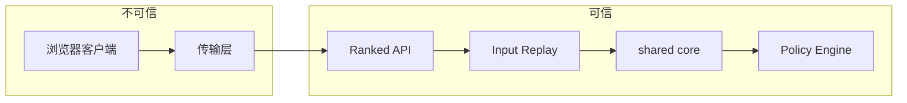
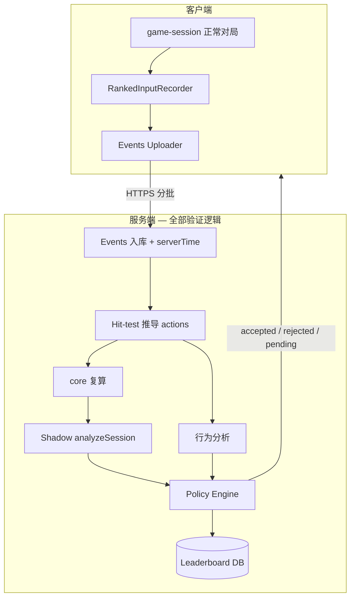

# 天梯榜与反作弊技术方案

> 版本 v0.1 · 2026-06-28  
> 状态：推荐方案（待评审）  
> 关联：`docs/PROJECT.md` Phase 6「本地纪录」、`docs/ARCHITECTURE.md`、`docs/MODES.md` § endless

---

## 1. 概述

### 1.1 背景

chill 当前为 **纯静态 SPA**（Vite + TS + Canvas），游戏逻辑在 `src/core/`，无后端。无尽模式已有完整计分、卷轴、AI 助手（DEV）及无头模拟脚本 `scripts/simulate-endless-ai.ts`。

若引入 **公开天梯榜**，需解决两类问题：

| 问题         | 说明                                                                                              |
| ------------ | ------------------------------------------------------------------------------------------------- |
| **分数可信** | 客户端提交的 score / depth 不可信，须服务端复算                                                   |
| **操作来源** | 与 UI 操作等价的 `{ kind, row, col }` 可由脚本直接生成；须验证 **输入过程**（指针轨迹、按键时间） |

### 1.2 设计结论（推荐）

采用 **「客户端静默采集 + 服务端黑盒验证」** 双轨架构：

1. **客户端**：排位模式下静默记录 pointer / keyboard / layout 事件，分批上传；**不包含**反作弊判定逻辑。
2. **服务端**：hit-test 重放 → 共享 `core` 复算 → 行为分析 + Shadow AI → 综合决策是否收录；**规则与阈值不下发客户端**。
3. **产品分层**：本地纪录（无上传）与公开天梯（须验证）并存；对外仅返回 `accepted | rejected | pending`。

### 1.3 目标

- 公开天梯收录 **规则合法** 且 **输入链可信** 的无尽模式成绩
- 显著提高脚本 / 游戏内 AI 路径的作弊成本（不可期望 100% 杜绝）
- 保持 `src/core/` 无 DOM、UI 无规则的分层约束
- 验证过程对玩家 **不透明**；隐私与保留策略可说明，算法细节不公开

### 1.4 非目标（本阶段）

- 经典 / 六边形模式天梯（可后续扩展同一套 pipeline）
- 服务端 **逐步权威** 跑局（延迟与实现成本过高，仅赛事级再考虑）
- 客户端内置反作弊 SDK、公开 reject 原因码
- 替代本地纪录；本地榜仍走 IndexedDB / localStorage，零后端

---

## 2. 威胁模型

### 2.1 攻击面

| 手段                                 | 难度 | 说明                                     |
| ------------------------------------ | ---- | ---------------------------------------- |
| 改内存 / 控制台改 `session.score`    | 低   | 仅提交终局分数时无效（服务端复算）       |
| 直接调用 `revealAt` / `applyAiMove`  | 低   | 与 UI 输出相同 action 序列               |
| 运行 `simulate-endless-ai.ts` 类脚本 | 低   | 无 pointer 事件链                        |
| 伪造 `{ kind, row, col }` 日志       | 中   | 缺 move 样本与 down/up 时序              |
| 伪造带 jitter 的 pointer 序列        | 中高 | 需过间隔方差 + Shadow AI 检测            |
| 录制真人操作回放                     | 高   | 可能过单局检测；重复 hash / 人工复核可抓 |

### 2.2 信任边界



**原则：** 客户端与上传内容一律视为不可信；上榜资格仅由服务端 pipeline 决定。

---

## 3. 总体架构



### 3.1 与现有分层的关系

| 层                                | 职责                                                                                            |
| --------------------------------- | ----------------------------------------------------------------------------------------------- |
| `src/core/`                       | 不变；服务端通过 **同包或 git submodule** 引用同一 TS 源码复算                                  |
| `src/ui/`                         | 在 `pointer-handlers.ts` 等处 **挂钩 recorder**；hit-test 逻辑服务端复用 `renderer/hit-test.ts` |
| `src/app/game-session/`           | 排位模式启用 recorder + uploader；**禁用** `createAiController` 与 DEV 快捷键                   |
| 新建 `workers/ranked/` 或独立服务 | API、复算、Policy；**不进前端 bundle**                                                          |

---

## 4. 客户端：输入采集

### 4.1 设计原则

- **只采集，不判定**：客户端不知道阈值、Shadow AI、拒榜原因。
- **原始输入优先**：上传 pointer / key / layout，**不上传** `{ kind, row, col }` 作为唯一依据。
- **与现有坐标系一致**：使用 `getCanvasPointerCoords` 的 canvas 逻辑坐标；layout 事件携带 `boardOffsetX/Y`、canvas 尺寸、cell 布局参数，供服务端 hit-test。

### 4.2 事件 Schema

```typescript
/** t = 相对 run 开始的毫秒数（单调递增） */
type RunInputEvent =
  | { t: number; e: 'move'; x: number; y: number }
  | { t: number; e: 'down'; btn: 0 | 2; x: number; y: number }
  | { t: number; e: 'up'; btn: 0 | 2; x: number; y: number }
  | { t: number; e: 'key'; code: 'Space' }
  | { t: number; e: 'layout'; w: number; h: number; ox: number; oy: number; rows: number; cols: number; cell: number }

interface RankedRunMeta {
  runId: string
  modeId: 'endless'
  coreVersion: string // 与 manifest / git tag 对齐
  clientBuild: string // 可选，仅服务端日志
}
```

**推导规则（服务端执行，与客户端行为对齐）：**

| 输入                                | 推导动作                                          |
| ----------------------------------- | ------------------------------------------------- |
| `down` btn=0，hit 格子，非双线      | `reveal(row, col)`                                |
| `contextmenu` / 等价 touch 插旗手势 | `toggleFlag(row, col)`                            |
| 双线 / `dblclick`                   | `chord(row, col)`                                 |
| `key` Space                         | `manualScroll()` → `endlessScrollTick(batchRows)` |

参考实现位置：

- 鼠标：`src/ui/game-canvas/input/pointer-handlers.ts`
- Space：`src/app/game-session/mount.ts` → `scroll.performScrollTick(true)`
- Hit-test：`src/ui/renderer/hit-test.ts`

### 4.3 体量控制

| 策略      | 参数（建议）                               |
| --------- | ------------------------------------------ |
| move 节流 | 间隔 ≥ 40ms 或位移 ≥ 2px                   |
| 关键帧    | 每个 `down` / `up` / `key` / `layout` 必记 |
| 动作窗口  | 每个 `down` 前 500ms 内的 move 全保留      |
| 分批上传  | 每 30s 或每 50 个推导 action 一批          |
| 坐标量化  | Int16 足够（canvas 逻辑像素）              |

### 4.4 模块划分（建议路径）

```
src/app/game-session/
  ranked/
    input-recorder.ts      # 纯 TS，append / flush
    input-uploader.ts      # fetch + 重试 + 离线队列（可选）
    types.ts               # RunInputEvent, RankedRunMeta
```

挂钩点：

- `pointer-handlers.ts`：`onMouseMove` / `onMouseDown` / `onMouseUp` / `onContextMenu` / `onDoubleClick`
- 触控：统一 Pointer Events 后同一 recorder（见 `docs/MOBILE-TOUCH-INPUT-PLAN.md`）
- `mount.ts`：Space `keydown`；排位模式不注册 DEV `A` 键

### 4.5 排位模式开关

- 入口：mode-hub「天梯无尽」或 URL `?ranked=1`（实现时二选一）
- 生产包：**不挂载** `createAiController`；`devAutoVisible` 恒 false
- 普通无尽 / 本地练习：**不启用** recorder，零网络开销

---

## 5. 服务端：验证 Pipeline

所有步骤在 **finish 后异步** 执行；玩家先看到 `pending`，完成后更新为 `accepted` 或 `rejected`（文案模糊，如「本次成绩未能收录」）。

### 5.1 阶段一 — 完整性与 Replay 合法性

1. 校验 `runId`、`seed` 由本服务签发，未重复 finish
2. events `t` 单调；layout 与 seed 对应开局参数一致
3. 按时间序 hit-test 推导 actions
4. 用共享 `core` 逐步 `revealAt` / `chordAt` / `toggleMarkAt` / `endlessScrollTick` 复算
5. 终局 `score`、`scrollRowCount`、`lives` 与复算结果 **完全一致**，否则 **硬拒绝**

> 此阶段解决「改分」「非法操作序列」，**不**解决「是否人类」。

### 5.2 阶段二 — 输入链验证（反脚本）

对每个 **有效推导 action**（reveal / chord / flag / manual scroll）计算：

```typescript
interface InputChainMetrics {
  moveSamplesBeforeDown: number // down 前窗口内 move 条数
  pathLengthPx: number // 轨迹长度
  straightLineRatio: number // 路径长 / 起终点直线距离
  clickDurationMs: number // down → up（若有 up）
  idleBeforeActionMs: number // 上一 action → 本次 down
}
```

**内部策略示例（阈值不下发）：**

- 连续多次 action 的 `moveSamplesBeforeDown === 0` → 拒或降权
- `idleBeforeActionMs` 方差极低且集中在 80–400ms → 与 `getEndlessAiStepMs` 吻合，提高 bot 分
- Space scroll 频率与 `getEndlessScrollProfile(elapsed)` 不合理 → 标记

### 5.3 阶段三 — Shadow AI（反 solver）

复算每一步时并行执行 `analyzeSession(session, elapsedMs)`（`src/core/ai/solver.ts`）：

```typescript
interface ShadowAiMetrics {
  aiMoveMatchRate: number // 玩家推导步 === analysis.move 的比例
  certainMoveRate: number
  guessCount: number
  unflagCount: number // 人类较少；AI heal/scroll 策略可另计
}
```

- `aiMoveMatchRate` 持续 > 0.95 且输入链极「干净」→ suspected bot
- **不与单一阈值硬绑**；与阶段二加权合并

### 5.4 阶段四 — Policy Engine

```typescript
type RankedDecision = 'accepted' | 'rejected' | 'review'

interface PolicyInput {
  replayOk: boolean
  inputChainScore: number // 0–1，内部
  shadowAiScore: number // 0–1，内部，越低越像 bot
  riskFlags: string[] // 仅内部日志
}

interface PolicyConfig {
  version: string // 远程配置，可随时调整
  weights: { input: number; shadow: number; risk: number }
  acceptThreshold: number
  reviewThreshold: number
}
```

- `accepted`：写入公开榜
- `review`：暂不展示或进待审核（Top N 人工看 replay）
- `rejected`：不展示；**不向客户端返回** `riskFlags` 或分项分数

### 5.5 时间戳

- 客户端 `t` 用于 **replay 顺序** 与 **相对间隔**
- 服务端 `serverTime` 用于 **流式上传间隔**、防「本地跑完后一次性提交」
- 竞技榜 **不以客户端声称的 elapsedMs 排名**（若未来比速，用 server 侧 action 间隔或单独计时通道）

---

## 6. API 契约（对外最小面）

客户端 **仅** 依赖以下接口；验证细节不在 API 暴露。

### 6.1 创建对局

```http
POST /v1/ranked/runs
Content-Type: application/json

{ "modeId": "endless" }
```

```json
{
  "runId": "uuid",
  "seed": 1234567890,
  "coreVersion": "2026.06.28",
  "uploadIntervalMs": 30000
}
```

`seed` **必须**由服务端生成，防止客户端刷好盘。

### 6.2 上传事件（游戏中分批）

```http
POST /v1/ranked/runs/:runId/events
Content-Type: application/json

{
  "seq": 1,
  "events": [ /* RunInputEvent[] */ ]
}
```

响应：`{ "ok": true }` — **无**校验详情。

### 6.3 结束对局

```http
POST /v1/ranked/runs/:runId/finish
Content-Type: application/json

{ "claimedScore": 12345, "claimedDepth": 42 }
```

响应：

```json
{ "status": "pending" }
```

异步完成后（轮询或 WebSocket 可选）：

```json
{ "status": "accepted", "rank": 128, "score": 12345, "depth": 42 }
```

或：

```json
{ "status": "rejected" }
```

**禁止返回：** `rejectReason`、`aiMoveMatchRate`、`needMoveSamples` 等。

### 6.4 排行榜

```http
GET /v1/ranked/leaderboard?mode=endless&limit=50
```

公开字段：`rank`, `displayName`, `score`, `depth`, `submittedAt` — 不含 replay 原始数据。

---

## 7. 服务端技术选型（推荐）

| 组件        | 推荐                                  | 理由                        |
| ----------- | ------------------------------------- | --------------------------- |
| API         | Cloudflare Worker 或 Vercel Functions | 与静态 SPA 部署一致、低运维 |
| DB          | D1 / Postgres / Supabase              | 榜 + run 元数据             |
| 原始 events | R2 / S3，TTL 30 天                    | 体积大、复核后删            |
| core 复算   | Worker 内 bundled TS 或独立 Node 服务 | 与 `src/core` 同源          |
| 配置        | Worker env / 远程 KV                  | Policy 阈值不下发前端       |

**共享 core 方式（二选一）：**

1.  monorepo：`packages/core` 被 SPA 与 Worker 同时 import
2.  CI 打包时将 `src/core` + `src/ui/renderer/hit-test.ts` 复制进 Worker 构建

---

## 8. 隐私与合规

### 8.1 玩家可见说明（FAQ / 隐私政策）

- 参与天梯时，会处理 **操作与输入时序** 用于反作弊与成绩校验
- 不采集键盘除 Space 外的内容、不采集棋盘外应用数据
- 原始 events **保留 N 天（建议 30）** 后删除；榜单条目保留聚合字段

### 8.2 不可向玩家承诺

- 「100% 无作弊」
- 具体检测算法、鼠标采样率、AI 对比逻辑

---

## 9. 榜单产品设计

### 9.1 分层

| 榜单            | 验证        | 说明                     |
| --------------- | ----------- | ------------------------ |
| 本地纪录        | 无          | Phase 6；IndexedDB       |
| 无尽天梯        | 全 pipeline | 本方案                   |
| 待审核 / 赛季榜 | 可选        | Top 10 `review` 人工通过 |

### 9.2 排序键（建议）

无尽模式主排序：**score DESC**；同分 **depth DESC**；再 **submittedAt ASC**。

是否展示 `elapsedMs` 由产品决定；若展示，须来自服务端统计，非客户端计时器。

---

## 10. 分阶段落地

### Phase A — 本地 recorder（无后端）

- [ ] `ranked/input-recorder.ts` + pointer 挂钩
- [ ] DEV 导出 JSON；人工查看轨迹是否合理
- [ ] 单元测试：down/up → 与 hit-test 推导 action 一致

**验收：** 一整局 endless 导出 events，能肉眼看出生疏/熟练操作差异。

### Phase B — 服务端 Replay

- [ ] `POST /runs` + `/events` + `/finish`
- [ ] Worker 内 core 复算；仅 `replayOk` 时暂存
- [ ] 客户端 `pending` → `accepted` 轮询

**验收：** 改 `claimedScore` 必 rejected；合法对局 accepted。

### Phase C — 输入链 + Shadow AI

- [ ] Policy Engine + 远程配置
- [ ] 无 move 样本脚本拒榜；`simulate-endless-ai.ts` 输出拒榜
- [ ] 内部 dashboard 看 `riskFlags`（不对玩家）

**验收：** 无头 AI 模拟不上榜；正常手打多局 accepted 率可接受。

### Phase D — 产品化

- [ ] mode-hub 天梯入口
- [ ] 排行榜 UI
- [ ] 隐私文案、events TTL 清理 job
- [ ] Top N 人工复核流程（可选）

---

## 11. 与现有代码对照

| 现有                             | 天梯方案                                      |
| -------------------------------- | --------------------------------------------- |
| `applyAiMove` / `ai-loop.ts`     | 排位模式不挂载；脚本仍可调 core，靠服务端检测 |
| `logPlayerAction`                | 保留 UI 日志；排位以 recorder events 为准     |
| `import.meta.env.DEV` AUTO       | 生产已隐藏；排位双重禁用                      |
| `scripts/simulate-endless-ai.ts` | 作为 Phase C 拒榜回归测试                     |
| Phase 6 本地纪录                 | 并行；recorder 可复用，上传可选               |

---

## 12. 风险与局限

| 风险                           | 缓解                                            |
| ------------------------------ | ----------------------------------------------- |
| 高手玩法接近 AI，误伤          | `review` 档 + 申诉；阈值保守；Shadow 仅作加权   |
| Determined 作弊者伪造 pointer  | 提高成本；流式上传 + 行为 + 人工 Top 复核       |
| core 规则变更导致旧 run 无效   | `coreVersion` 分榜；旧 run 只读归档             |
| events 体积与成本              | 节流、TTL、分批                                 |
| 移动端 touch 与 mouse 事件差异 | 统一 Pointer schema；见 MOBILE-TOUCH-INPUT-PLAN |

---

## 13. 开放问题（评审时决定）

1. **账号体系**：匿名 deviceId vs 登录（OAuth）— 影响刷榜与申诉
2. **首版是否只做 endless**：classic 复算简单但竞技意义弱
3. **Worker 冷启动 vs 长局 replay CPU 上限** — 是否需要异步队列（Queue + 独立 worker）
4. **是否赛季制** — 便于 `coreVersion` 与榜重置

---

## 14. 文档变更

| 日期       | 版本 | 变更                                           |
| ---------- | ---- | ---------------------------------------------- |
| 2026-06-28 | v0.1 | 初稿：客户端采集 + 服务端黑盒验证 + 分阶段落地 |

实现启动时同步：

- `docs/PROJECT.md` — Phase 6 / 新 Phase 条目
- `docs/MODULES.md` — `RankedInputRecorder`、API 模块接口
- `docs/ARCHITECTURE.md` — 服务端与 ranked 目录（实现后）
