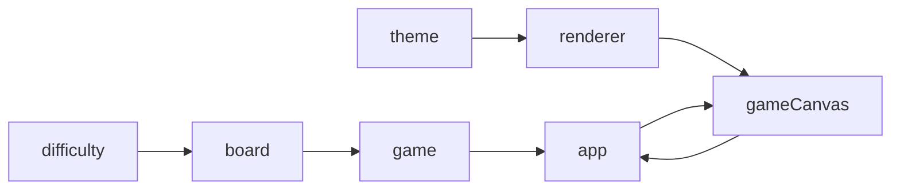

# 扫雷 Web 游戏 — 模块说明 v0.2

> 各模块职责、接口与依赖。实现须符合 `docs/SPEC.md` 与 `docs/ARCHITECTURE.md`。

---

## 依赖关系



---

## `src/core/*`

（与 v0.1 相同，无 Canvas 依赖）

---

## `src/ui/theme.ts`

**职责：** 布局尺寸、经典配色、状态表情常量。

**导出：** `CELL_SIZE`, `THEME`, `STATUS_FACE`, `getCanvasSize`, `getGridOrigin`

---

## `src/ui/renderer.ts`

**职责：** 纯 Canvas 绘制与 hit-test；**无事件监听**。

**导出：**

| 符号 | 说明 |
|------|------|
| `getLayoutMetrics(rows, cols)` | HUD/棋盘/重开按钮区域 |
| `renderFrame(ctx, layout, state)` | 全帧绘制 |
| `hitTestCell(layout, rows, cols, x, y)` | 指针 → 格子坐标 |
| `hitTestReset(layout, x, y)` | 是否点中重开 |
| `getCanvasPointerCoords(canvas, event)` | 鼠标 → 逻辑坐标 |

---

## `src/ui/game-canvas.ts`

**职责：** 创建 `<canvas>`、HiDPI、指针事件、计时器、调度 `renderFrame`。

**导出：**

```typescript
interface GameCanvasCallbacks {
  onReveal(row: number, col: number): void;
  onToggleFlag(row: number, col: number): void;
  onReset(): void;
}

function createGameCanvas(
  container: HTMLElement,
  rows: number,
  cols: number,
  mineTotal: number,
  cb: GameCanvasCallbacks,
): GameCanvasController;
```

**行为：** `mousedown` 左键开格/重开；`contextmenu` 插旗

---

## `src/app/app.ts`

**职责：** 组装 core + `game-canvas`；唯一连接逻辑与渲染。

---

## 版本

| 版本 | 日期 | 说明 |
|------|------|------|
| v0.1 | 2026-06-14 | DOM 版 grid/hud |
| v0.2 | 2026-06-14 | Canvas 2D：theme / renderer / game-canvas |
