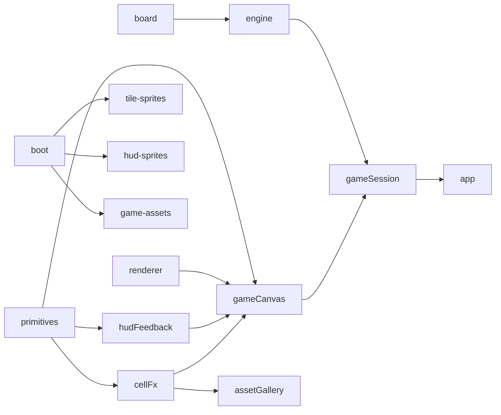

# 扫雷 Web 游戏 — 模块说明 v0.3

> 各模块职责、接口与依赖。实现须符合 `docs/SPEC.md` 与 `docs/ARCHITECTURE.md`。

---

## 依赖关系

---

## `src/core/*`

| 模块              | 职责                                                        |
| ----------------- | ----------------------------------------------------------- |
| `board.ts`        | 邻格、克隆、布雷辅助                                        |
| `modes/engine.ts` | 门面：`createSession`, `revealAt`, `chordAt`, `applyAiMove` |
| `modes/endless/`  | 无尽规则：grid, scroll, reveal-pipeline, player-actions     |
| `ai/solver.ts`    | `analyzeSession`, `getEndlessAiStepMs`                      |
| `ai/moves/`       | `solveBoard`, `pickTacticalMove`, `bottomRowNeedsWork`      |

**约束：** 无 `document` / `window`。

---

## `src/ui/primitives/`

**职责：** 跨模块复用的数学、路径、资源加载。

**导出：** `clamp01`, `lerp`, `easeOutCubic`, `roundedRectPath`, `fillRounded`, `loadRuntimeImage`

---

## `src/ui/boot/`

**职责：** 启动期资源编排、加权进度、DOM 加载页（`index.html` 内联壳 + `boot-screen.ts` 更新）。

| 文件                | 职责                                           |
| ------------------- | ---------------------------------------------- |
| `asset-registry.ts` | tiles / HUD / manifest / hud-feedback URL 清单 |
| `asset-loader.ts`   | 并发 `Image` 加载、重试、写入 cache            |
| `asset-cache.ts`    | 全局图片缓存 + manifest 快照                   |
| `boot-sequence.ts`  | `runBootSequence()` Tier 1–2 阻塞加载          |
| `boot-screen.ts`    | 绑定 `#boot-screen`、进度/错误/淡出            |
| `preload-audio.ts`  | Tier 3 音频后台预热                            |

**导出：** `runBootSequence`, `bindBootScreen`, `preloadGameAudio`, `getCachedImage`, …

**约束：** 不依赖 `game-canvas/`、`app/`；加载页零游戏 PNG。

---

## `src/ui/renderer/`

**职责：** 纯 Canvas 棋盘绘制与 hit-test；**无事件监听**。

**导出：** `renderFrame`, `renderBoardStaticFrame`, `renderBoardDynamicFrame`, `hitTestCell`, `getLayoutMetrics`, …

---

## `src/ui/game-canvas/`

**职责：** Canvas 元素、HiDPI、RAF、HUD、Overlay、指针事件、计时器。

| 子目录      | 职责                                     |
| ----------- | ---------------------------------------- |
| `create.ts` | 工厂入口，返回 `GameCanvasController`    |
| `runtime/`  | `paint`, board cache, cell FX 队列, 粒子 |
| `hud/`      | Score / Combo / Lives / Dev 控件绘制     |
| `overlay/`  | 生命损失、难度警报、Start/Retry 面板     |
| `input/`    | 指针与 UI hit-test                       |

**导出：** `createGameCanvas`, `GameCanvasController`, `GameCanvasOptions`, …

---

## `src/ui/hud-feedback/`

**职责：** ScorePop / ComboBurst 纯绘制与进度计算。

**导出：** `drawScorePopV3`, `drawComboBurstV3`, `getComboFeedbackPalette`, `scorePopRuntimeProgress`, …

薄 re-export：`hud-feedback-fx.ts`

---

## `src/ui/cell-fx/`

**职责：** 格子呼吸、揭示、烟雾、旗标、面板扫描。

**子目录 `gallery/`：** Asset Lab 预览场景（cell/board/mine/flag/heart）。

薄 re-export：`cell-fx.ts`

---

## `src/app/game-session/`

**职责：** 组装 core + game-canvas；卷轴定时、AI 循环、日志。

**导出：** `mountGameSession`

---

## `src/app/asset-gallery/`

**职责：** 资产预览 Lab；HUD 场景复用 `game-canvas/hud/*`，cell 场景复用 `cell-fx/gallery/*`。

**导出：** `mountEffectPanels`, `EffectPanelId`

---

## `src/app/app.ts`

**职责：** 路由：`/` → game-session，`/assets` → asset-gallery，`/lab` → ui-lab。

---

## 版本

| 版本 | 日期       | 说明                                                             |
| ---- | ---------- | ---------------------------------------------------------------- |
| v0.1 | 2026-06-14 | DOM 版 grid/hud                                                  |
| v0.2 | 2026-06-14 | Canvas 2D：theme / renderer / game-canvas                        |
| v0.3 | 2026-06-28 | 模块化拆分；`primitives`, `hud-feedback/`, `game-canvas/` 子目录 |
| v0.4 | 2026-06-28 | 新增 `src/ui/boot/` 启动加载器                                   |
