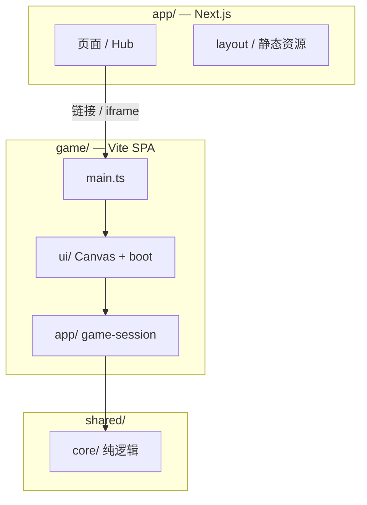

# Next.js 平台 + 独立游戏客户端 — 技术方案

> 版本 v0.1 · 2026-06-28  
> 状态：**Phase A 已实施**（平台 Next.js + 游戏 Vite 分目录）  
> 参考：`cloud-services/vercel-web-scripts` 项目结构（非 Turborepo monorepo）  
> 关联：`docs/ARCHITECTURE.md`（当前 Vite SPA）、`docs/LEADERBOARD-ANTI-CHEAT-PLAN.md`（后续扩展，本阶段不实施）

---

## 1. 概述

### 1.1 背景

当前 chill 为 **单仓库 Vite SPA**：`src/core` 纯逻辑 + `src/ui` Canvas 渲染 + `src/app` 轻量路由。玩法与资产加载已稳定，后续需要：

- **平台层**：首页、模式 Hub、文档、将来可能的账号与 API
- **游戏层**：保持 Vite + Canvas 独立构建，不塞进 React 组件树

本方案在 **一个 git 仓库** 内拆分 **Next.js 平台壳** 与 **Vite 游戏客户端**，对齐个人项目集 `cloud-services/vercel-*` 中 `vercel-web-scripts` 的惯例（`app/` + `preset/` 同仓、根脚本编排、无 turbo）。

### 1.2 设计结论（已定稿）

| 决策       | 结论                                                                  |
| ---------- | --------------------------------------------------------------------- |
| 仓库形态   | **单 repo**，逻辑分目录；**非** 两个独立 git                          |
| 平台框架   | **Next.js 16** App Router + React 19                                  |
| 游戏框架   | **保留 Vite**（现有 boot / SW / Canvas 不动）                         |
| 共享逻辑   | `shared/core/`（原 `src/core`），tsconfig paths 引用                  |
| 构建编排   | 根 `package.json` scripts + `concurrently`；**不用 Turborepo**        |
| 部署       | **两个 Vercel Project**（Next 平台 + 游戏静态站），可无 `vercel.json` |
| 游戏接入   | 子域名 `play.*` 或 iframe；**不把 Canvas 写进 Next 页面**             |
| 本阶段范围 | 仅平台壳 + 目录迁移；**不含天梯、API、DB、认证**                      |

### 1.3 非目标（本阶段）

- 不实施 `LEADERBOARD-ANTI-CHEAT-PLAN.md` 任何 Phase
- 不引入 `app/api/*` 业务路由（骨架可预留空目录）
- 不把游戏迁入 Next Client Component
- 不拆成两个 git 仓库
- 不强制对齐 `vercel-web-scripts` 的 OTA content-addressed 分发（可选 Phase 2）

---

## 2. 为何单仓库、分目录

| 方案                                      | 结论                                                                      |
| ----------------------------------------- | ------------------------------------------------------------------------- |
| **单 repo：`app/` + `game/` + `shared/`** | ✅ 采用。与 `vercel-web-scripts` 一致；`core` 改一处生效；一条 `pnpm dev` |
| 双 repo：`chill-web` + `chill-game`       | ❌ 暂不采用。`core` 需发包或复制，同步成本高；等发布节奏完全独立再考虑    |
| 游戏塞进 Next `app/play/page.tsx`         | ❌ 不采用。破坏 HMR、boot、SW；包体与 Canvas 生命周期冲突                 |

**「游戏仍是单独项目」** 指 **独立 Vite 构建产物与部署单元**，不是第二个 git。

---

## 3. 目标目录结构

```
chill/                              # 单 git，对齐 vercel-web-scripts 根布局
├── app/                            # Next.js 16 — 平台壳
│   ├── layout.tsx
│   ├── page.tsx                    # 首页 / mode hub
│   ├── play/
│   │   └── page.tsx                # 跳转 play 子域或 iframe
│   └── globals.css
├── game/                           # 现有 Vite 游戏（从 src/ 迁入）
│   ├── index.html
│   ├── vite.config.ts
│   ├── public/
│   │   └── assets/                 # PNG 源资产；WebP/SW 由 build 生成
│   └── src/
│       ├── main.ts
│       ├── ui/                     # Canvas、boot、renderer…
│       └── app/                    # game-session、asset-gallery、routes
├── shared/
│   └── core/                       # 原 src/core — 纯逻辑，无 DOM
│       ├── board.ts, types.ts
│       ├── modes/, ai/
│       └── ...
├── scripts/                        # gen-boot-manifest、optimize-boot-webp、test
├── docs/
├── package.json                    # 根编排：dev / build / test
├── pnpm-workspace.yaml             # packages: []（仅 allowBuilds，同 web-scripts）
├── next.config.ts
├── tsconfig.json                   # paths: @shared/core, @/*
└── .gitignore                      # 已忽略 boot 构建产物（webp、sw.js 等）
```

### 3.1 与 `vercel-web-scripts` 映射

| vercel-web-scripts             | chill（本方案）                                          |
| ------------------------------ | -------------------------------------------------------- |
| `app/`                         | `app/` — Next 平台                                       |
| `preset/`                      | `game/` — Vite 运行时                                    |
| `editor-lib/`、`explorer-lib/` | 暂不拆；DEV Asset Lab 留在 `game/src/app/asset-gallery/` |
| `shared/`                      | `shared/` — 以 `core` 为主                               |
| `services/`                    | 本阶段无；将来天梯/API 再加                              |
| `extension/`                   | 不需要                                                   |

---

## 4. 分层与依赖



| 目录            | 允许依赖                      | 禁止                        |
| --------------- | ----------------------------- | --------------------------- |
| `shared/core/`  | 无 DOM、无 React              | `game/`、`app/`             |
| `game/src/ui/`  | `shared/core`、浏览器 API     | Next、React 平台组件        |
| `game/src/app/` | `ui/`、`shared/core`          | `app/`                      |
| `app/`          | React、Next、将来 `services/` | 直接 import Canvas 绘制模块 |

---

## 5. 技术选型

### 5.1 依赖版本（对齐 cloud-services / vercel-web-scripts）

| 包                | 目标版本           | 用途                          |
| ----------------- | ------------------ | ----------------------------- |
| next              | 16.1.x             | 平台                          |
| react / react-dom | 19.2.x             | 平台 UI                       |
| typescript        | 5.7.x              | 全仓                          |
| pnpm              | 11.5.x             | 包管理，`packageManager` 锁定 |
| vite              | 保持游戏现有主版本 | 仅 `game/`                    |
| sharp             | 已有               | boot WebP 脚本                |

**本阶段不引入：** zod API 层、Jest 大迁移、DB 客户端。（Signet 登录已接入，见 `services/auth/`、`.env.example`。）

### 5.2 构建脚本（根 package.json 示意）

```json
{
  "scripts": {
    "dev": "concurrently -n next,game \"next dev --webpack\" \"pnpm --dir game dev\"",
    "build": "pnpm build:game && next build --webpack",
    "build:game": "cd game && pnpm build",
    "format": "prettier --config .prettierrc.js --write \"**/*.{js,jsx,ts,tsx,d.ts,md,json,yml,yaml}\"",
    "lint": "pnpm lint:ts",
    "lint:ts": "eslint -c eslint.config.mjs --fix .",
    "test": "jest -c ./jest.config.ts --coverage --reporters=default --reporters=jest-junit",
    "ok": "pnpm format && pnpm lint && pnpm typecheck && pnpm test",
    "typecheck": "tsc --noEmit && cd game && tsc --noEmit"
  }
}
```

工程化工具链与 `vercel-web-scripts` 对齐：ESLint、Prettier（`format` / `format:check`）、Jest、Husky + lint-staged + commitlint + commitizen；`ok` / `ci` 一键校验。

游戏 `build` 保持现有链：`optimize-boot-webp` → `gen-boot-manifest` → `gen-service-worker` → `tsc` → `vite build`。

开发期：`app/play/page.tsx` 用 iframe 嵌入 Vite（`GAME_DEV_URL`，默认 `http://localhost:5173`）；用户入口始终是 Next（`:3000` / `/play`）。

---

## 6. 游戏与平台的连接

### 6.1 推荐：Next 入口 + 游戏客户端 URL

| 环境 | 平台（用户入口）            | 游戏（Vite 构建 / 独立部署）      |
| ---- | --------------------------- | --------------------------------- |
| 生产 | `https://chill.example.com` | `https://play.chill.example.com`  |
| 本地 | `http://localhost:3000`     | `http://localhost:5173`（iframe） |

`app/page.tsx`：全屏 iframe 嵌入 `NEXT_PUBLIC_GAME_URL`（生产）或 `GAME_DEV_URL`（开发，默认 `http://localhost:5173`）。无其它 Next 页面。

环境变量：

```bash
NEXT_PUBLIC_GAME_URL=https://play.chill.example.com
GAME_DEV_URL=http://localhost:5173
```

### 6.2 备选：子域直达（无 iframe）

- 首页外链到 `play.*` 子域，不经过 `/play` iframe
- 适合将来需要完全独立游戏域名的场景

### 6.3 明确不做

- 不在 Next 内 `import` `game-canvas/create.ts`
- 不把 `public/assets` 交给 Next `public/` 统一托管（游戏构建自包含）

---

## 7. 部署

### 7.1 两个 Vercel Project（同仓不同 Root / Build）

| Project      | Root Directory         | Build Command                                 | 输出         |
| ------------ | ---------------------- | --------------------------------------------- | ------------ |
| `chill-web`  | `/`（或仅 build Next） | `pnpm build` 需跳过 game 或 `next build` only | Next server  |
| `chill-play` | `game`                 | `pnpm build`（game 子包脚本）                 | 静态 `dist/` |

与 `cloud-services` 其它 `vercel-*` 相同：**无 `vercel.json`**，靠 Vercel 自动检测 + README 说明。

### 7.2 构建产物与 Git

以下由 `npm run build` 生成，**不入库**（已在 `.gitignore`）：

- `public/assets/**/*.webp`
- `public/assets/boot-weights.json`
- `public/assets/boot-webp-map.json`
- `public/sw.js`（游戏侧）

部署 `chill-play` 前须执行完整 `build:game`；CI 中显式跑构建链。

---

## 8. TypeScript 路径

根 `tsconfig.json` 示意：

```json
{
  "compilerOptions": {
    "paths": {
      "@shared/core/*": ["./shared/core/*"],
      "@/*": ["./app/*"]
    }
  },
  "exclude": ["game", "node_modules"]
}
```

`game/tsconfig.json`：

```json
{
  "compilerOptions": {
    "paths": {
      "@shared/core/*": ["../shared/core/*"]
    }
  }
}
```

`game/` 与 `app/` 从 Next 根 `tsc` 中 **exclude**（同 `vercel-web-scripts` 对 preset/extension 的处理）。

---

## 9. 分阶段实施

### Phase A — 仓库壳子（优先）

- [x] 根目录初始化 Next.js `app/`（首页 + 占位 `play`）
- [x] 创建 `shared/core/`，迁移 `src/core/`
- [x] `src/` 其余迁入 `game/src/`，`index.html`、`vite.config` 迁入 `game/`
- [x] 更新 import 为 `@shared/core`
- [x] 根 `package.json` 编排 `dev` / `build`
- [x] `pnpm test` / `pnpm build` 通过

**验收：** 本地 `pnpm dev` 可同时开 Next 首页与游戏；游戏玩法与现网一致。

### Phase B — 部署与环境

- [ ] 配置 `NEXT_PUBLIC_GAME_URL`
- [ ] Vercel 双 Project 或单 Project 静态子路径验证
- [ ] 更新 `docs/ARCHITECTURE.md` 指向本方案

### Phase C — 平台内容（可选）

- [ ] 首页 mode hub 设计（classic / hex / endless 入口链到 play）
- [ ] `@vercel/analytics`、基础 SEO
- [x] 从 `vercel-*` 复制 `services/auth/`（Signet + 本地 dev 登录）

### 将来扩展（不在本方案实施）

- `services/ranked/` + `app/api/runs/*` → 见 `LEADERBOARD-ANTI-CHEAT-PLAN.md`
- OTA 静态分发 → 参考 `vercel-web-scripts` `app/static/[key]/[hash]/`
- 拆第二个 git repo

---

## 10. 风险与对策

| 风险                 | 对策                                                       |
| -------------------- | ---------------------------------------------------------- |
| `core` 路径断裂      | Phase A 一次性改 import；`scripts/run-tests.ts` 覆盖       |
| 双 dev 端口混乱      | `concurrently` 固定 next:3000、game:5173                   |
| 游戏 assets 路径变化 | `game/vite.config` `base` 与 `public/` 保持相对根不变      |
| Next 误引游戏 UI     | ESLint `no-restricted-imports` 禁止 `app/` → `game/src/ui` |
| 部署漏跑 boot 脚本   | `chill-play` CI 固定 `pnpm build:game` 全链                |

---

## 11. 文档同步清单

实施完成后更新：

| 文档                                  | 变更                                 |
| ------------------------------------- | ------------------------------------ |
| `docs/ARCHITECTURE.md`                | 标注「平台 Next + 游戏 Vite」为 v0.4 |
| `docs/PROJECT.md`                     | Current Task / 文档索引              |
| `docs/MODULES.md`                     | `shared/core`、`game/`、`app/` 路径  |
| `.cursor/skills/minesweeper/SKILL.md` | 单文件行数约束路径更新               |

---

## 版本

| 版本 | 日期       | 说明                                                |
| ---- | ---------- | --------------------------------------------------- |
| v0.1 | 2026-06-28 | 初稿：单仓分目录、对齐 vercel-web-scripts、不含天梯 |
