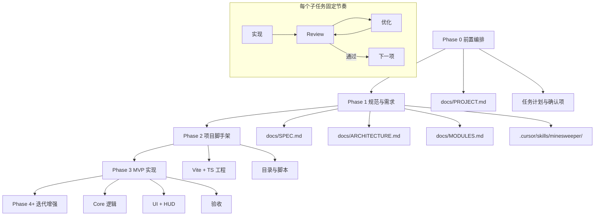

# Phase 0 — 前置任务编排

本文档描述扫雷 Web 游戏在写代码之前的全部前置工作及其依赖顺序。确认后可按序执行 Phase 1 → 2 → 3。

---

## 总览

---

## Phase 0 任务清单（当前阶段）

| ID | 任务 | 产出 | 依赖 | 估时 |
|----|------|------|------|------|
| 0.1 | 划分迭代阶段 | 本文档 + PROJECT.md TODO | — | ✅ 完成 |
| 0.2 | 定义文档结构 | `docs/PROJECT.md` 模板 | 0.1 | ✅ 完成 |
| 0.3 | 确认 MVP 范围 | 采用推荐默认，无需逐项确认 | 0.2 | ✅ 完成 |
| 0.4 | 定义 Skill 边界 | Skill 职责说明（见下） | 0.2 | ✅ 完成 |
| 0.5 | Review → Phase 1 | `REVIEW-LOG.md` 记录通过 | 0.3, 0.4 | ✅ 完成 |

### 0.3 待确认项（MVP 边界）

| 选项 | 建议默认值 | 说明 |
|------|------------|------|
| 难度 | 仅初级 9×9 / 10 雷 | 最传统扫雷入门配置 |
| 平台 | 桌面浏览器优先 | MVP 不做移动端手势 |
| 技术栈 | Vite + TypeScript + 原生 DOM | 轻量、逻辑与 UI 分离清晰 |
| 测试 | MVP 后补 core 单测 | Phase 3 以手动验收为主 |
| 样式 | 简洁经典灰格 + 数字色 | 可后续换肤 |

### 0.4 Skill 目录规划（Phase 1 创建）

路径：`.cursor/skills/minesweeper/`

| 文件 | 用途 |
|------|------|
| `SKILL.md` | 触发条件、开发约定、文档索引、验收 checklist |
| `reference.md`（可选） | 扫雷算法与边界 case 速查 |
| `examples.md`（可选） | 提交信息、模块扩展示例 |

**Skill 应教会 Agent：**

- 修改前先读 `docs/PROJECT.md` 的 Current Task 与 TODO
- 核心逻辑放在 `src/core/`，禁止在 UI 层写布雷/邻雷算法
- 规则以 `docs/SPEC.md` 为准；冲突时 SPEC 优先
- MVP 功能列表与 Phase 4 backlog 的边界

---

## Phase 1 任务清单（规范与需求）

| ID | 任务 | 产出 | 依赖 |
|----|------|------|------|
| 1.1 | 游戏规则与交互规范 | `docs/SPEC.md` | 0.5 |
| 1.2 | 技术架构文档 | `docs/ARCHITECTURE.md` | 0.5 |
| 1.3 | 模块接口说明 | `docs/MODULES.md` | 1.1, 1.2 |
| 1.4 | 项目 Skill | `.cursor/skills/minesweeper/SKILL.md` | 1.1–1.3 |
| 1.5 | 同步 PROJECT.md 摘要 | 更新规范/模块表 | 1.4 |

**1.1 SPEC 必含章节：**

- 棋盘与雷数
- 左键 / 右键 /  chord（MVP 可不做 chord）
- 首次点击安全区算法
- 自动展开空白区（flood fill）
- 胜负与重开
- 明确 MVP 不做项

**1.2 ARCHITECTURE 必含章节：**

- 技术选型理由
- 目录树
- 数据流（UserEvent → Game → Board → UI）
- 状态不可变 vs 可变策略

---

## Phase 2 任务清单（脚手架）

| ID | 任务 | 产出 | 依赖 |
|----|------|------|------|
| 2.1 | `npm create vite` 初始化 | `package.json`, `vite.config.ts` | 1.2 |
| 2.2 | 目录骨架 | `src/core/`, `src/ui/`, `src/app/` | 2.1 |
| 2.3 | 开发/构建脚本验证 | `npm run dev` 可访问 | 2.2 |
| 2.4 | README 最小说明 | 根目录 `README.md` | 2.3 |

---

## Phase 3 任务清单（MVP 实现顺序）

> 严格按依赖顺序实现，避免 UI 先行导致逻辑返工。

| 顺序 | ID | 任务 | 验收标准 |
|------|-----|------|----------|
| 1 | 3.1 | `Board`：生成、布雷、邻雷数 | 单元/脚本可打印棋盘 |
| 2 | 3.1b | 首次点击重新布雷 | 首格及 8 邻格无雷 |
| 3 | 3.2 | `Game`：开格、flood fill、插旗 | 逻辑与 SPEC 一致 |
| 4 | 3.2b | 胜负判定 | 赢/输/进行中三态正确 |
| 5 | 3.3 | `Grid` UI | 左键开格、右键插旗 |
| 6 | 3.4 | 难度与重开 | 9×9/10 雷，一键新局 |
| 7 | 3.5 | HUD：计时 + 雷计数 | 与 classic 行为接近 |
| 8 | 3.6 | 端到端手动验收 | 更新 PROJECT.md TODO |

---

## 逐步 Review 流程（每个子任务）

1. **实现** — 只做 Current Task 对应的一项 TODO
2. **Review** — 检查：范围、与规范一致、可维护性、边界 case、文档同步
3. **优化** — Review 发现问题则修改；改完再 Review，直到通过
4. **记录** — 写入 `docs/REVIEW-LOG.md`（模板见该文件）
5. **推进** — 勾选 TODO、更新 Current Task、进入下一项

用户可在任一步 Review 后说「继续」；Agent 默认 Review 通过且无待议项时进入下一项。

---

## Phase Gate（阶段汇总 Review）

每个 Phase 最后一项子任务 Review 通过后，再做 Phase 级汇总：

- [x] **Gate A → Phase 1**：Phase 0 Review 通过
- [ ] **Gate B → Phase 2**：1.1–1.5 全部 Review 通过
- [ ] **Gate C → Phase 3**：2.1–2.4 全部 Review 通过
- [ ] **Gate D → Phase 4**：3.1–3.6 全部 Review 通过

---

## 建议的 Agent 工作方式

1. 每次会话开始：读 `PROJECT.md` → Current Task → 最近一条 `REVIEW-LOG.md`
2. **一次只做一个子任务**；完成后必须 Review，禁止连跳多项
3. MVP 无特殊要求时用推荐方案，不因选型阻塞
4. 规则/架构变更：先改 SPEC/ARCHITECTURE，再改代码
5. Review 通过后再勾选 TODO、更新 Current Task
