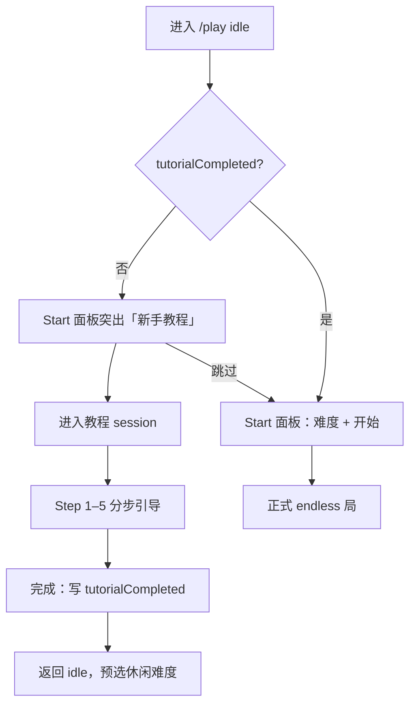

# 新手教程技术方案

> 版本 v0.1 · 2026-06-29  
> 状态：待实施  
> 关联：`docs/MOBILE-TOUCH-INPUT-PLAN.md`、`docs/DIFFICULTY-PRESET-PLAN.md`、`docs/MODES.md` § endless、`docs/SPEC.md` §3

---

## 1. 概述

### 1.1 背景

当前 `game-client/ui/game-canvas/overlay/game-intro.ts` 仅负责 **开场视觉动画**（能量线、棋盘渐显、Start 面板弹出），不教授扫雷规则。部分玩家可能完全不了解：

- 数字含义（邻格雷数）
- 开格 / 插旗 / Chord
- 无尽模式特有机制（卷轴压力、生命、手动上移）

移动端触摸映射已实现（`MOBILE-TOUCH-INPUT-PLAN.md`），但无引导说明。

### 1.2 目标

为 **零基础玩家** 提供可跳过的交互式教程：

1. 在 **固定教学棋盘** 上分步完成操作（无纯猜、无随机挫败）
2. 按平台展示不同操作提示（PC 键鼠 vs 移动端触摸）
3. 全程 **Canvas 绘制**（提示条、手势示意、格高亮），MVP **不依赖新图片资源**
4. 教程 **不计分、不上榜、不进入排位流水**
5. 完成后引导进入正式局，默认选中 **休闲** 难度（见 `DIFFICULTY-PRESET-PLAN.md`）

### 1.3 设计结论（已定稿）

| 项           | 结论                                                         |
| ------------ | ------------------------------------------------------------ |
| 教程形态     | 独立 `tutorial` session，非无尽随机盘边玩边教                |
| 棋盘         | Core 层固定布局（7×7 或 9×9 子盘），确定性、每步唯一期望操作 |
| UI           | Canvas overlay + 输入门控；复用 AI hint / 滑旗光晕等现有绘制 |
| 移动端手势图 | MVP 用矢量（圆点、箭头、双圆脉冲）；不阻塞上线               |
| 首次进入     | 默认弹出教程入口，**可跳过**                                 |
| 持久化       | `localStorage` 记录 `tutorialCompleted`                      |
| 排行榜       | **不计**（不写本地高分、不触发 ranked recorder）             |

### 1.4 非目标

- 不做视频、长图文页、独立 HTML 教程路由
- 不在教程中教授高级技巧（概率猜雷、消雷回血策略等）
- 不改造 hex / classic 模式教程（后续可复用同一 overlay 模块）
- MVP 不新增手指位图资产（可选 Phase B 打磨）

---

## 2. 玩家流程



### 2.1 Start 面板扩展（idle）

在现有 Start overlay（`event-overlay.ts`）增加：

| 控件               | 行为                                 |
| ------------------ | ------------------------------------ |
| **新手教程**       | 进入 `mountTutorialSession()`        |
| **跳过**（教程内） | 等同完成教程，写 `tutorialCompleted` |
| **开始**           | 按所选难度开正式局                   |

首次未完成教程时，「新手教程」按钮视觉优先级高于「开始」。

---

## 3. 教学步骤

共 **5 步**。每步包含：`id`、`title`、`body`（短文案）、`allowedActions`、`successCondition`、`highlights`。

### Step 1 — 开格

| 平台   | 提示文案（示例）   |
| ------ | ------------------ |
| PC     | 左键点击高亮格翻开 |
| Mobile | 点击高亮格翻开     |

- **高亮**：1 个安全格（脉冲框 + 可选 `shield-safe-zone` cutout）
- **允许**：`reveal` 目标格
- **拒绝**：其他格开格 → 轻提示「先点击高亮格」；插旗/Chord 忽略
- **完成**：目标格 `revealed === true`

### Step 2 — 读数字

- **场景**：Step 1 翻开格后，邻格显示数字 `1`
- **说明**：「数字表示周围 8 格中有几颗雷」（动画圈出 8 邻）
- **允许**：任意点击（含继续开格）或 **下一步** 按钮
- **完成**：玩家点击「知道了」/ 自动 3s 后可点下一步（二选一，实现时取更简单者：**显式下一步按钮**）

### Step 3 — 插旗

| 平台   | 提示文案                       |
| ------ | ------------------------------ |
| PC     | 右键点击高亮格插旗             |
| Mobile | 按住高亮格，向上或向下滑动插旗 |

- **高亮**：1 个雷格（未翻开）
- **允许**：`toggleFlag` 目标格（移动端走现有滑旗手势）
- **完成**：目标格 `mark === 'flag'`
- **视觉**：复用 `drawCellFlagSwipeTargetOverlay`；教程层叠加竖直箭头 + 往返动画点

### Step 4 — Chord（双线）

| 平台   | 提示文案                           |
| ------ | ---------------------------------- |
| PC     | 双击已翻开的数字格，或左右键同时按 |
| Mobile | 双击已翻开的数字格                 |

- **场景**：数字格周围旗数已匹配邻雷数
- **高亮**：目标数字格 + `chord-crosshair` cutout
- **允许**：`chord` 目标格
- **完成**：Chord 成功执行（邻格翻开）

### Step 5 — 无尽机制（迷你演示）

在 **慢速 preset 子集** 下演示（非完整无尽盘）：

1. **卷轴**：展示底行压力条；提示 Space（PC）/ SCROLL 按钮（Mobile）
2. **生命**：文字说明 5 命、踩雷 −1、底行漏格 −1
3. **操作**：玩家手动触发 **一次** 上移（或观看自动演示后点「完成」）

- 使用 `casual` preset 的 **单档** 参数：`intervalMs = 12000`、`batchRows = 1`（仅本步，见难度文档 §4.4）
- **完成**：点击「完成教程」

---

## 4. 架构与分层

```
shared/core/modes/tutorial/     固定棋盘、步骤定义、成功判定（无 DOM）
game-client/app/game-session/   tutorial-session.ts 状态机、与 mount 集成
game-client/ui/game-canvas/
  overlay/tutorial-overlay.ts   提示条、手势矢量、下一步/跳过 hit rect
  overlay/tutorial-gestures.ts  drawTapHint / drawSwipeHint / drawDoubleTapHint
  input/pointer-handlers.ts     教程输入门控（先于常规 handler）
```

### 4.1 信任边界

| 层              | 职责                                                            |
| --------------- | --------------------------------------------------------------- |
| `shared/core/`  | 教学棋盘数据、步骤枚举、`isTutorialStepComplete(session, step)` |
| `game-session/` | 步骤推进、`allowedAction` 过滤、不写 ranked / 本地榜            |
| `ui/`           | 绘制与 hit-test；**不**改布雷/胜负规则                          |

### 4.2 与 cosmetic intro 的关系

| 模块                  | 作用                       |
| --------------------- | -------------------------- |
| `game-intro.ts`       | 首次 idle 视觉入场（保留） |
| `tutorial-overlay.ts` | 教程 session 内步骤 UI     |

二者独立：可先播放入场动画，再点「新手教程」进入教学局。

---

## 5. Core API（草案）

### 5.1 类型

```typescript
/** shared/core/modes/tutorial/types.ts */
export type TutorialStepId = 'reveal' | 'read-number' | 'flag' | 'chord' | 'endless-basics'

export type TutorialAllowedAction = 'reveal' | 'toggleFlag' | 'chord' | 'manualScroll' | 'ui-next'

export interface TutorialStepDef {
  id: TutorialStepId
  allowed: readonly TutorialAllowedAction[]
  /** Screen-local cell targets; null = no cell gate */
  targetCell: { row: number; col: number } | null
}

export interface TutorialSessionMeta {
  kind: 'tutorial'
  stepIndex: number
  steps: readonly TutorialStepDef[]
}
```

### 5.2 工厂

```typescript
/** shared/core/modes/tutorial/board.ts */
export function createTutorialSession(): ModeSession
export function getTutorialStep(session: ModeSession): TutorialStepDef
export function isTutorialActionAllowed(session: ModeSession, action: TutorialAllowedAction, cell?: { row: number; col: number }): boolean
export function advanceTutorialIfComplete(session: ModeSession): ModeSession
export function isTutorialFinished(session: ModeSession): boolean
```

- `ModeSession` 扩展字段：`tutorial?: TutorialSessionMeta`（或 `modeId: 'tutorial'` + 专用 factory）
- 教学棋盘：**预置** `minesPlaced: true`，禁用首击布雷随机性

### 5.3 固定棋盘

- 尺寸：**7 列 × 7 行**（可见区居中，周围暗化）
- 种子：常量 `TUTORIAL_BOARD_SEED`（实现时选定并单测锁定）
- 布局要求：Step 1–4 无猜雷；Step 5 单独小场景或同一盘静态区 + 假卷轴 HUD

---

## 6. Session 集成

### 6.1 mount.ts 分支

```typescript
// 伪代码
function startTutorial(): void {
  runtime.session = createTutorialSession()
  runtime.tutorialActive = true
  // 不调用 rankedRecorder / createRankedRunOnServer
  render()
}

function onTutorialReveal(row, col): void {
  if (!isTutorialActionAllowed(session, 'reveal', { row, col })) {
    tutorialBumpHint('wrong-cell')
    return
  }
  const next = revealAt(session, row, col) // 或教程专用 apply
  applySession(advanceTutorialIfComplete(next))
}
```

### 6.2 排行榜与本地纪录隔离

| 路径                      | 教程 session |
| ------------------------- | ------------ |
| `rankedRecorder.record*`  | **不调用**   |
| `appendLocalScoreRecord`  | **不调用**   |
| `createRankedRunOnServer` | **不调用**   |
| `finishRankedRunOnServer` | **不调用**   |

### 6.3 持久化

扩展 `game-client/config/local-settings.ts`：

```typescript
export interface LocalSettings {
  bgmMuted: boolean
  tutorialCompleted: boolean
  difficultyPresetId: EndlessDifficultyPresetId // 见 DIFFICULTY-PRESET-PLAN.md
}
```

- 键：`chill-local-settings`（合并写入，向后兼容缺省 `tutorialCompleted: false`）
- 跳过教程：同样写 `tutorialCompleted: true`

---

## 7. Canvas UI

### 7.1 tutorial-overlay.ts

职责：

- 顶/底 **提示条**（标题 + 1 行正文，`stageLayout.scale` 自适应）
- **格高亮**（描边脉冲，颜色 `#60a5fa` / `#fbbf24`）
- **手势示意**（调用 `tutorial-gestures.ts`，锚定在目标格或提示条旁）
- **跳过**、**下一步**（Step 2）、**完成** 按钮 hit rect
- 半透明 scrim（可选，仅强调当前格时）

绘制挂接：在 `paint.ts` 的 `drawFullscreenOverlay` 之后，或在其内部当 `tutorialActive` 时 early branch。

### 7.2 tutorial-gestures.ts（矢量，无图片）

| 函数                | 绘制内容                                                  |
| ------------------- | --------------------------------------------------------- |
| `drawTapHint`       | 圆点 + 扩散涟漪（`sin` 动画）                             |
| `drawSwipeHint`     | 竖双向箭头 + 沿箭头移动的小圆                             |
| `drawDoubleTapHint` | 两个同心圆交替脉冲                                        |
| `drawKeycapHint`    | 复用 `space-hint` 圆角 keycap 风格，文案 `SPACE` / `右键` |

风格与 `drawScrollArrowIcon`、`drawArcadePanel` 一致；`prefers-reduced-motion` 时静态帧。

### 7.3 输入门控

在 `pointer-handlers.ts` 最前：

```typescript
if (rt.state.tutorialActive && handleTutorialPointerDown(rt, x, y)) return true
```

教程进行中 `blocksBoardPointerInput` 等价扩展：非 `allowed` 操作不向下传递。

键盘：

- Space：仅 Step 5 且 `allowed` 含 `manualScroll` 时生效
- 右键 / contextmenu：Step 3 门控

---

## 8. 平台文案映射

| 操作  | `profile === 'desktop'` | `profile === 'mobile'` |
| ----- | ----------------------- | ---------------------- |
| 开格  | 左键点击                | 点击                   |
| 插旗  | 右键                    | 上滑或下滑             |
| Chord | 双击 / 左右键同按       | 双击                   |
| 上移  | `SPACE`                 | `SCROLL` 按钮          |

检测：`rt.state.stageLayout?.profile`（与 `MOBILE-TOUCH-INPUT-PLAN.md` 一致，`viewportW < 768` → mobile）。

---

## 9. 分阶段实施

### Phase A — 经典规则（Step 1–4）

- [ ] `shared/core/modes/tutorial/*` 棋盘 + 步骤判定单测
- [ ] `tutorial-session.ts` + mount 分支
- [ ] `tutorial-overlay.ts` + `tutorial-gestures.ts`
- [ ] `pointer-handlers` 门控
- [ ] `localSettings.tutorialCompleted`
- [ ] Start 面板「新手教程」入口

### Phase B — 无尽机制（Step 5）

- [ ] 慢速卷轴迷你演示 + Space/SCROLL 提示
- [ ] 完成后预选 `casual` 难度

### Phase C — 可选打磨

- [ ] 2–3 张手势 icon 位图（仅当矢量反馈不足）
- [ ] Playwright：教程完整流程截图

---

## 10. 验收标准

- [ ] 零基础玩家可在 **5 分钟内** 完成教程（含跳过路径）
- [ ] 每步仅接受规定操作；错误操作有轻提示、不扣命、不崩局
- [ ] 移动端：滑旗步骤可完成，箭头示意可见
- [ ] PC：右键插旗、双击 Chord、Space 演示可用
- [ ] 教程结束写 `tutorialCompleted`；刷新后不再强制弹出
- [ ] 教程全程 **无** ranked 事件、**无** 本地高分写入
- [ ] `npm run build` + 教程 core 单测通过
- [ ] 无单文件 > 800 行

---

## 11. 文档同步（实现后）

- [ ] `docs/MODES.md`：增加 `tutorial` 条目或 § endless 引导小节
- [ ] `docs/MODULES.md`：导出 `createTutorialSession` 等
- [ ] `docs/REVIEW-LOG.md`：每 Phase Review 记录

---

## 12. 版本

| 版本 | 日期       | 说明                                 |
| ---- | ---------- | ------------------------------------ |
| v0.1 | 2026-06-29 | 初稿：步骤、分层、Canvas MVP、不计榜 |
